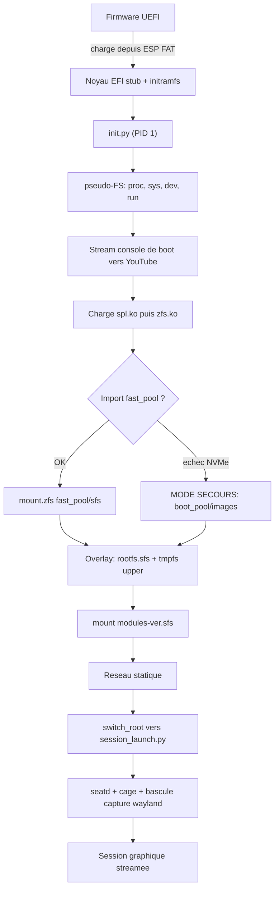
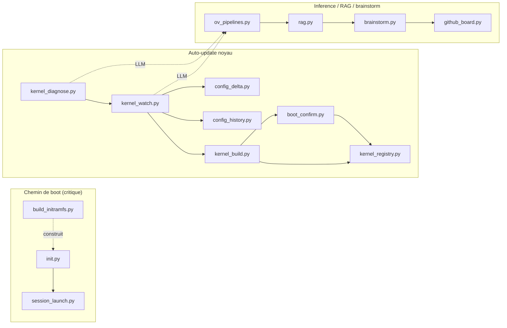
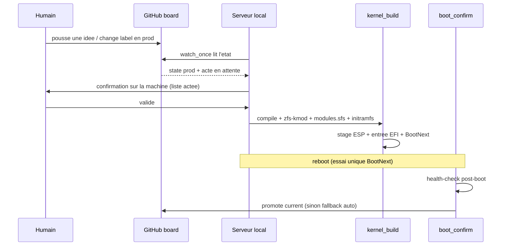

# Boot ZFS + stream YouTube — appliance Gentoo (100% Python)

Système minimal qui boote en **UEFI direct** (EFI stub, sans ZFSBootMenu) sur un
noyau dont l'**initramfs est piloté par Python** : il importe un pool ZFS, monte
un rootfs Gentoo en **squashfs + overlay**, configure le **réseau statique très
tôt**, **stream** le framebuffer puis Wayland vers YouTube, et expose une
**boucle d'auto-update du noyau** pilotée par un LLM local (**Ollama**) avec
garde-fou de boot.

Tous les scripts sont en **Python**. `/init` lui-même est un programme Python
(via `ctypes` pour `mount`/`finit_module`/loop/`switch_root`) ; aucun shell sur
le chemin de boot normal (busybox n'est embarqué que comme secours).

## Matériel cible

- CPU **Intel i5-11400** (Rocket Lake, 6c/12t, AVX-512 VNNI si activé au BIOS)
- iGPU **UHD 730** (`8086:4c8b`) piloté par **xe** (`force_probe=4c8b`), **i915** en repli
- NIC **Realtek r8169** + **REALTEK_PHY** en dur
- **ZFS** en module hors-arbre (CDDL — jamais `=y`)
- 128 Go DDR4, 2 NVMe en stripe — pas de NPU, l'inférence vise le CPU

## Fonctionnement (schémas)

### Séquence de boot



### Les trois sous-systèmes et leurs fichiers



### Boucle compile → boot → promotion (pilotée depuis GitHub)



---

## Disposition ZFS

Trois pools, avec des niveaux de redondance **très différents** — c'est
structurant pour la sécurité des données :

| Pool | Type | Survit à | Rôle |
|---|---|---|---|
| `boot_pool` | mirror SATA (5 disques) | 4 disques | master rootfs/init + `boot_pool/manager` (index) + déploiement |
| `data_pool` | raidz2 SATA | 2 disques | `home`, modèles, `archives` (snapshots), `log` (réplication) |
| `fast_pool` | **stripe** 2×NVMe | **0 disque** | rootfs de travail, overlays, sfs, logs (rapide, **fragile**) |

> **`fast_pool` est un stripe (RAID0) : aucune redondance.** Si un seul NVMe
> lâche, **tout `fast_pool` est perdu et irrécupérable** (pas de parité). Tout
> ce qui doit survivre doit donc avoir un master/réplica sur `boot_pool` ou
> `data_pool`. Les snapshots *locaux* de `fast_pool` ne protègent pas d'une
> panne disque : il faut un `zfs send` vers `data_pool/archives`.

Datasets principaux :
```
boot_pool/images        rootfs.sfs MASTER (déployé en strip sur les NVMe)
boot_pool/manager       index/historique du gestionnaire (durable, git-friendly)
fast_pool/sfs           rootfs.sfs (travail) + modules-<ver>.sfs
fast_pool/rootfs        overlay racine (upper) — PERDU si un NVMe lâche
fast_pool/log           /var/log persistant (rapide)
data_pool/log           réplication durable des logs (zfs send depuis fast_pool)
data_pool/home          données, modèles (10 To+)
data_pool/archives      snapshots / sauvegardes (cible des zfs send)
```

Le firmware UEFI ne lit pas ZFS : noyau et initramfs sont **stagés sur l'ESP
FAT32**. Les **deux ESP** (`nvme0n1p1`, `nvme1n1p1`, tenues en phase par rsync)
permettent de booter sur l'autre disque depuis le BIOS si l'un meurt.

### Mode dégradé (lecture seule + réparation)

Deux situations déclenchent le mode dégradé, **sans jamais écrire sur un dataset
suspect** (upper = tmpfs jetable) :

- **`fast_pool` absent** (NVMe en panne — stripe perdu) : `init.py` bascule sur
  `boot_pool/images/rootfs.sfs`.
- **`fast_pool` importé mais un overlay corrompu** (`fast_pool/rootfs` ou `var`
  existe mais ne se monte pas / non inscriptible) : le dataset suspect **n'est
  pas monté**, on garde le rootfs.sfs en lower + un upper tmpfs.

Dans les deux cas : système **utilisable mais volatile** (rien de persistant
écrit), un rapport est posé dans `/etc/degraded-report`, et `session_launch.py`
détecte `/etc/rescue-mode` → **affiche le rapport** (console + stream YouTube) et
ouvre un **shell de réparation** au lieu de la session normale. Le stream de
l'initramfs n'est pas coupé : le rapport reste visible à distance.

Distinction importante : un dataset **absent** (1er boot, pas encore créé) n'est
PAS une corruption → simple tmpfs, pas de bascule réparation. Seul un dataset
**existant mais inutilisable** déclenche le dégradé.

> La survie des overlays suppose une réplication `zfs send` vers
> `data_pool/archives` + une remontée **manuelle**. Sans réplication, l'upper
> est perdu à la panne NVMe (mais le système reboote en dégradé, réparable).

### Changement de rootfs.sfs sous un upper persistant

Piège réel avec un upper **persistant** (système mutable) : l'upper ne contient
que les **diffs** par rapport au `rootfs.sfs` (lower) qui l'a engendré. Si on
repackage un nouveau `rootfs.sfs` en gardant l'ancien upper, des fichiers
obsolètes de l'upper **masquent silencieusement** les nouveaux du sfs (et les
whiteouts périmés cachent des fichiers réintroduits) → système incohérent.

`init.py` gère ça automatiquement via le **CRC32** (zlib, streaming) du
`rootfs.sfs`, comparé au marqueur `.sfs-crc` stocké dans l'upper :
- marqueur absent (1er boot) → on le pose, upper neuf ;
- CRC identique → upper réutilisé tel quel ;
- **CRC différent (sfs changé)** → upper périmé : `init.py` **snapshote** l'ancien
  upper (`fast_pool/rootfs@presfs-<crc>-<ts>`), l'**envoie vers
  `data_pool/archives`** (durable), puis **vide le contenu** de l'upper (pas le
  dataset → xattr/acl conservés) et repose le marqueur. Les modifs repartent
  proprement du nouveau sfs.

CRC32 (et non SHA-256) : on détecte un *changement*, pas une attaque ; c'est
rapide (accéléré SSE4.2 sur le i5) et suffisant. Récupérer un ancien upper
snapshoté est **manuel** (dans `data_pool/archives/rootfs-presfs-<crc>`).

> **En pratique, `rootfs.sfs` change rarement.** Les mises à jour courantes
> portent sur le **noyau et les modules** (`/usr/src` → nouveau
> `modules-<ver>.sfs`), suivies par le registre + l'historique de config
> incrémentale — *pas* par l'overlay. `modules-<ver>.sfs` est monté en lecture
> seule par version (jamais d'upper), donc aucun risque de péremption pour lui.
> Le `rootfs.sfs` n'est repackagé que lors d'un `emerge world` délibéré ; le
> garde-fou CRC32 ne se déclenche que ce jour-là. L'upper persistant
> `fast_pool/rootfs` sert surtout à conserver les ajustements *runtime* entre
> deux boots, pas à appliquer les mises à jour.

---

## Création des datasets (par type)

Règles ZFS à connaître avant de créer :
- **Les propriétés s'héritent** : posées sur le pool ou un parent, elles
  s'appliquent à tout ce qui est en-dessous. On pose donc les valeurs communes
  haut, et on surcharge par dataset.
- **Une propriété ne s'applique qu'aux écritures *suivantes*** — il faut la poser
  **à la création**, pas après coup (sinon les fichiers déjà écrits gardent
  l'ancienne valeur). `casesensitivity` et `normalization` sont **figés** à la
  création.
- `xattr=sa` + `acltype=posixacl` : nécessaires partout où le rootfs porte des
  ACL/capabilities/contextes (overlays, rootfs de secours), et plus performants
  que les xattr « directory ».

### Réglages hérités (une fois, au niveau pool)

```sh
# valeurs communes posees haut -> heritees par tous les datasets crees ensuite
zfs set atime=off          fast_pool
zfs set xattr=sa           fast_pool
zfs set acltype=posixacl   fast_pool
zfs set compression=zstd   fast_pool   # surcharge en off pour les .sfs (cf. plus bas)
zfs set atime=off xattr=sa acltype=posixacl compression=zstd boot_pool
zfs set atime=off xattr=sa acltype=posixacl compression=zstd data_pool
```

### Par type de dataset

```sh
# --- 1. Stockage de .sfs (deja compresses) : PAS de double compression -------
zfs create -o compression=off -o recordsize=1M \
           -o mountpoint=/fast_pool/sfs              fast_pool/sfs
#   recordsize=1M : gros fichiers .sfs lus sequentiellement ; compression=off
#   car squashfs est deja en zstd.

# --- 2. Overlays PERSISTANTS (montes par init.py au boot) --------------------
# upper de l'overlay racine -> systeme mutable et persistant entre les boots.
zfs create -o compression=zstd -o xattr=sa -o acltype=posixacl \
           -o mountpoint=/fast_pool/rootfs           fast_pool/rootfs
# /var lui-meme reste DANS l'overlay rootfs (pas de dataset separe). Seul
# /var/log est persistant (journaux qui survivent aux reboots) :
zfs create -o compression=zstd -o recordsize=128K \
           -o mountpoint=/fast_pool/log              fast_pool/log
#   rootfs = upper de l'overlay ; log monte sur /var/log (/var vient de l'overlay).
#   init.py les monte automatiquement (sautes en mode secours -> tmpfs).
#   /tmp reste un tmpfs volatile : PAS de dataset (ephemere par nature).

# --- 2bis. Sources du noyau (build) : dataset dedie, monte sur /usr/src ------
zfs create -o compression=zstd -o atime=off \
           -o mountpoint=/fast_pool/usr-src          fast_pool/usr-src
#   init.py le monte sur NEWROOT/usr/src : les sources + l'arbre de build
#   PERSISTENT entre les boots (pas de recompilation complete a chaque fois).
#   emerge installe les sources la ; kernel_build.py compile la.

# --- 3. Logs : replica durable -----------------------------------------------
zfs create -o compression=zstd -o recordsize=128K \
           -o mountpoint=/data_pool/log              data_pool/log   # replica durable

# --- 4. boot_pool (mirror SATA, durable) : masters + restauration ------------
zfs create -o compression=off \
           -o mountpoint=/boot_pool/images           boot_pool/images   # rootfs.sfs master
zfs create -o compression=zstd \
           -o mountpoint=/boot_pool/manager          boot_pool/manager  # index (git-friendly)
zfs create -o compression=zstd \
           -o mountpoint=/boot_pool/efi-backup        boot_pool/efi-backup
#   efi-backup : copie des DEUX ESP (vmlinuz, initramfs, entrees) pour
#   restaurer une partition FAT corrompue ou re-deployer un NVMe remplace.
#   boot_pool contient aussi une copie kernel+initrd de secours (source du
#   mode degrade via boot_pool/images).

# --- 5. Donnees & archives (data_pool, raidz2) -------------------------------
zfs create -o compression=zstd -o recordsize=1M \
           -o mountpoint=/data_pool/home             data_pool/home     # modeles, data
zfs create -o compression=zstd \
           -o mountpoint=/data_pool/archives         data_pool/archives # cible zfs send

# --- 6. Reserve d'espace (20% de fast_pool a ne jamais remplir) --------------
#   Plutot qu'un dataset vide (grignotable), une refreservation au niveau pool :
zfs create -o refreservation=200G -o mountpoint=none fast_pool/reserve
#   (ajuste 200G selon 20% de ta capacite reelle de fast_pool)
```

### Type de montage (qui monte quoi, et quand)

| Dataset | Monté par | Type |
|---|---|---|
| `fast_pool/sfs`, `boot_pool/images` | `init.py` (initramfs) | `mount.zfs` explicite, **pas** d'auto-mount |
| `fast_pool/rootfs` (upper) | `init.py` | upper de l'overlay racine (persistant) |
| `fast_pool/log`, `fast_pool/usr-src` | `init.py` | `mount.zfs` sur `NEWROOT/{var/log,usr/src}` (`/var` vient de l'overlay) |
| `boot_pool/manager`, `data_pool/*` | système booté (OpenRC) | auto-mount ZFS standard (mountpoint) |

> En **mode secours** (fast_pool absent), `init.py` saute tous les datasets
> `fast_pool/*` : upper = tmpfs volatile, pas de var/log/usr-src persistants.
> Le système de secours est minimal et éphémère, par conception.

> `init.py` importe les pools avec `zpool import -N` (**`-N` = ne monte aucun
> dataset automatiquement**) puis fait des `mount.zfs` explicites : le boot
> contrôle exactement l'ordre et les cibles. Les datasets en `mountpoint=...`
> qui ne sont PAS sur le chemin de boot (`boot_pool/manager`, `data_pool/*`)
> sont montés normalement par le service ZFS une fois le système démarré.

> `mountpoint=none` (ex. `fast_pool/reserve`) = jamais monté, sert juste à
> réserver/organiser. `mountpoint=legacy` = monté via `/etc/fstab` ou
> `mount -t zfs` manuel (on ne l'utilise pas ici, on préfère `mount.zfs`
> explicite dans `init.py`).

---

## Arborescence du projet

Trois sous-systèmes indépendants. Seul le premier est sur le **chemin de boot
critique** (un échec = kernel panic / pas de boot) ; les deux autres sont de
l'espace utilisateur (un échec = fonctionnalité absente, jamais de panic).

```
.
├── README.md
│
├── common.py             # SOCLE userspace : sh() unifie + helpers ZFS partages
│                         #   + Result observable + is_true + ConfigView.
│                         #   JAMAIS importe par le chemin de boot (init reste autonome)
├── boot_layout.py        # source de verite des ESP : distingue install_mount
│                         #   (echafaudage) de l'identite finale (PARTUUID) ; garde anti-/boot
│
│  ── BOOT (chemin critique) ──────────────────────────────────────────
├── init.py               # PID 1 de l'initramfs (ctypes) — installé comme /init
│                         #   pseudo-FS → charge zfs → import pool → santé →
│                         #   overlay squashfs → réseau → stream → switch_root
├── build_initramfs.py    # construit initramfs-<ver>.zst : CPython + busybox +
│                         #   zpool/zfs/mount.zfs/ip + famille zfs.ko + firmware
├── initramfs_verify.py   # verifie le contenu d'un initramfs (sans booter) +
│                         #   checksums SHA-256 + manifeste d'integrite
├── sfs_build.py          # cree rootfs.sfs + modules-<ver>.sfs (staging tmpfs,
│                         #   nettoyage, controle) -- appele par first_boot/kernel_build
├── clean_rootfs.py       # prepare une racine Gentoo PROPRE sur une COPIE (rsync
│                         #   -aHAX) avant de figer en rootfs.sfs (jamais automatique)
├── uki_build.py          # UKI multi-profils (vmlinuz+initramfs+cmdline via objcopy)
│                         #   sur les 2 ESP + fallback BOOTX64.EFI ; pilote par [uki]
├── zfs_mounts.py         # detection/verification/montage de datasets (ismount +
│                         #   /proc/mounts + contenu) -- distingue 'monte' de 'dossier vide'
├── validate_boot.py      # valide SFS (montable + contenu) et ESP (vfat + place)
│                         #   avant de compter dessus -- module commun
├── zfs_replicate.py      # replication incrementale (zfs send -i) fast_pool/log
│                         #   -> data_pool/log (durable) ; rotation des snapshots
├── session_launch.py     # post-switch_root (PID 1 du rootfs) : seatd + cage +
│                         #   bascule du stream fbdev → capture wayland
├── efi_install.py        # install EFI initiale (un seul noyau, manuel)
├── first_boot.py         # orchestrateur first-boot (chroot) : verifie infra +
│                         #   compile + initramfs + EFI + rapport + autorisation git
├── infra.conf            # declaration de l'infrastructure VOULUE (a editer)
│
│  ── AUTO-UPDATE DU NOYAU (espace utilisateur) ───────────────────────
├── kernel_diagnose.py    # étape 0 : diagnostic de cohérence au démarrage
│                         #   (.config + dmesg + lsmod + health.json), non bloquant
├── kernel_watch.py       # étape 1 : veille amont (tags git) + nouveaux symboles
│                         #   Kconfig → propositions LLM → validation → fragment
├── config_delta.py       #   comparaison catégorisée de .config + ce qu'olddefconfig
│                         #   change tout seul (point aveugle comblé)
├── config_history.py     #   archivage versionné des configs + doc/raisons + SVG
├── kernel_build.py       # étape 2 : compile + garde-fou zfs.ko + modules.sfs +
│                         #   initramfs + stage ESP + entrée EFI + BootNext
├── boot_confirm.py       # étape 3 : health-check post-boot + promotion BootOrder
├── kernel_registry.py    #   index des versions : dataset ZFS/version + manifeste
│                         #   kernels.json + audit de cohérence (menage manuel)
│
│  ── INFÉRENCE / RAG / BRAINSTORM (espace utilisateur, OpenVINO) ──────
├── ov_pipelines.py       # registre de pipelines par métaclasse (auto-enregistrement)
│                         #   + back-ends interchangeables (OpenVINO prod / Stub test)
├── rag.py                # RAG multi-domaines : chunking, index, recherche+rerank
├── brainstorm.py         # fiche idée (3 couches : candidats/acté/état) + moteur
├── github_board.py       # pont board GitHub ↔ idées (Issues, REST) + watcher prod
├── github_project.py     # pont GitHub Projects v2 (GraphQL) : items = idées,
│                         #   statut = colonne ; déclencheur colonne OU label
├── test_github.py        # valide le pont Issues REST en réel (avant tout le reste)
└── test_project.py       # valide le pont Projects v2 GraphQL en réel
```

Fichiers déployés **dans le rootfs Gentoo** (cf. §5) :

```
/sbin/session_launch.py              # depuis session_launch.py
/usr/local/sbin/boot_confirm.py      # depuis boot_confirm.py
/etc/init.d/stream-session           # service OpenRC
/etc/init.d/boot-confirm             # service OpenRC
```

> **État de maturité (à lire avant de booter).** Tout a été testé *en
> isolation* (parsing, logique), jamais sur le matériel cible ni avec OpenVINO
> réel. Le bloc inférence/RAG/brainstorm tourne avec un back-end *stub* sans
> OpenVINO ; brancher `openvino_genai` nécessitera de vérifier les noms de
> méthode GenAI (isolés dans `ov_pipelines.OpenVINOBackend`). Le premier boot
> reste un test réel — d'où le filet `BootNext`/`BootOrder` (§ auto-update).

---

## 1. Système Gentoo — `make.conf`

```sh
# /etc/portage/make.conf
COMMON_FLAGS="-O2 -march=native -pipe"   # native -> AVX-512 VNNI si dispo (gain inférence CPU)
MAKEOPTS="-j12"                          # 6c/12t
VIDEO_CARDS="intel iris"                 # iris = Mesa GL Gen12 ; intel = Vulkan ANV
USE="vaapi wayland vulkan -X"
ACCEPT_KEYWORDS="amd64"
ACCEPT_LICENSE="* -@EULA"                # CDDL (zfs) + firmware redistribuable
```

> `lscpu | grep avx512` pour confirmer l'AVX-512 (BIOS-dépendant sur Rocket Lake).
> Après changement de flags : `emerge -e @world` (ou au moins recompiler `ollama`,
> `mesa`, `ffmpeg`, les modules noyau et `python`).

## 2. Overlay GURU + keywords / USE

```sh
eselect repository enable guru
emaint sync -r guru
```
```sh
# /etc/portage/package.accept_keywords/ai
sci-ml/ollama ~amd64

# /etc/portage/package.use/ai
sci-ml/ollama -cuda                       # Intel : PAS de cuda (évite le bug acct-user)
media-video/ffmpeg vaapi x264 opus vorbis
```

## 3. Paquets

```sh
# Boot / ZFS / EFI / outils initramfs
emerge -av sys-fs/zfs sys-fs/zfs-kmod sys-boot/efibootmgr \
           sys-fs/squashfs-tools app-arch/zstd app-arch/cpio \
           sys-apps/busybox sys-kernel/linux-firmware   # rtl_nic + GuC/HuC (xe)

# clang/LLVM requis par la chaine OpenCL Intel (intel-graphics-compiler ->
# opencl-clang -> llvm-core/clang). Categorie deplacee sys-devel -> llvm-core,
# paquets slottes. Le USE static-analyzer (actif par defaut) est obligatoire
# sur clang, sinon erreurs de linker au build d'opencl-clang :
echo "llvm-core/clang static-analyzer pie extra" >> /etc/portage/package.use/ai
emerge -av llvm-core/clang llvm-core/llvm
# USE=clang reste DESACTIVE par defaut sur profil non-LLVM (GCC continue a
# servir de compilateur systeme) -- seul le binaire clang est requis ici.

# iGPU : OpenCL + Level Zero (NEO) + VAAPI media
emerge -av dev-libs/intel-compute-runtime dev-libs/level-zero \
           media-libs/libva-intel-media-driver media-libs/libva
# le driver media s'appelle iHD ; libva charge l'ancien par defaut sans ca :
echo 'LIBVA_DRIVER_NAME="iHD"' >> /etc/env.d/90intel-media
env-update && source /etc/profile

# Session graphique + capture/stream
emerge -av gui-wm/cage sys-auth/seatd gui-apps/foot \
           gui-apps/wf-recorder media-video/ffmpeg
# wl-screenrec (préféré, VAAPI Intel) : GURU ou `cargo install wl-screenrec`

# Inférence
emerge -av sci-ml/ollama
# numpy : requis par rag.py (recherche vectorielle). Repli pur-Python existe
# mais numpy est fortement recommande (perf).
emerge -av dev-python/numpy
# configobj : requis par first_boot.py (lecture de infra.conf)
emerge -av dev-python/configobj
```

> `python3` (et donc `ctypes`) est déjà fourni par `dev-lang/python` sur Gentoo —
> rien à installer en plus pour les scripts du **boot**.

> **Bloc inférence/RAG/brainstorm** (`ov_pipelines.py`, `rag.py`, `brainstorm.py`,
> `github_board.py`) : OpenVINO GenAI n'est pas packagé sur Gentoo — il s'installe
> dans un venv dédié (cf. § OpenVINO). Tant qu'il est absent, le back-end *stub*
> prend le relais (`RAG_BACKEND=stub`) et tout reste fonctionnel pour le
> développement, sans inférence réelle. `github_board.py` n'a besoin que de la
> stdlib (+ un `GITHUB_TOKEN` pour le transport réel).

## 4. Accès GPU + service Ollama

```sh
usermod -aG render,video <utilisateur>     # /dev/dri (compositeur + compute)

rc-update add ollama default
rc-service ollama start                    # API sur http://127.0.0.1:11434
ollama pull qwen3:30b                       # tag exact à vérifier via `ollama list`
```

## 5. Déploiement des scripts dans le rootfs

À faire dans le rootfs Gentoo **avant** de générer `rootfs.sfs` :

```sh
install -m 0755 session_launch.py /sbin/session_launch.py
install -m 0755 boot_confirm.py   /usr/local/sbin/boot_confirm.py
```

Services OpenRC (le `/init` Python fait `switch_root` vers `/sbin/init` si tu
actives OpenRC — voir §10) :

```sh
# /etc/init.d/stream-session
#!/sbin/openrc-run
command="/usr/bin/python3"
command_args="/sbin/session_launch.py"
command_background="yes"
pidfile="/run/stream-session.pid"
depend() { after udev; }
```
```sh
# /etc/init.d/boot-confirm
#!/sbin/openrc-run
command="/usr/bin/python3"
command_args="/usr/local/sbin/boot_confirm.py"
depend() { after stream-session; }
```
```sh
rc-update add stream-session default
rc-update add boot-confirm  default
```

## 6. Noyau — `.config`

```
# Built-in
CONFIG_EFI=y, CONFIG_EFI_STUB=y
CONFIG_BINFMT_SCRIPT=y                   # exécuter /init via son shebang python
CONFIG_BLK_DEV_NVME=y, CONFIG_SATA_AHCI=y
CONFIG_SQUASHFS=y, CONFIG_SQUASHFS_ZSTD=y, CONFIG_SQUASHFS_XATTR=y
CONFIG_OVERLAY_FS=y, CONFIG_BLK_DEV_LOOP=y
CONFIG_DEVTMPFS=y, CONFIG_DEVTMPFS_MOUNT=y, CONFIG_TMPFS=y
CONFIG_DRM=y, CONFIG_DRM_XE=y, CONFIG_DRM_XE_DISPLAY=y
CONFIG_DRM_XE_FORCE_PROBE="4c8b"
CONFIG_DRM_I915=y                        # repli
CONFIG_FB=y, CONFIG_FRAMEBUFFER_CONSOLE=y, CONFIG_VT=y
CONFIG_DRM_FBDEV_EMULATION=y             # cree /dev/fb0 (capture fbdev du stream)
CONFIG_DRM_SIMPLEDRM=y, CONFIG_SYSFB_SIMPLEFB=y  # framebuffer EFI tres tot (boot)
CONFIG_R8169=y, CONFIG_REALTEK_PHY=y     # PHY en dur OBLIGATOIRE avec r8169=y
CONFIG_IP_PNP=y                          # réseau configuré avant l'userspace
CONFIG_FW_LOADER=y
CONFIG_RD_ZSTD=y                         # décompression de l'initramfs .zst

# Dépendances NOYAU de ZFS — DOIVENT être =y (en dur), sinon zfs.ko ne charge
# pas (finit_module ne résout pas les symboles manquants -> panic à l'étape 2).
# init.py charge zfs via finit_module SANS modprobe : aucune dépendance =m ne
# sera auto-chargée. D'où l'obligation du =y ci-dessous.
CONFIG_ZLIB_INFLATE=y, CONFIG_ZLIB_DEFLATE=y
CONFIG_CRYPTO=y, CONFIG_CRYPTO_DEFLATE=y
CONFIG_CRYPTO_SHA256=y, CONFIG_CRYPTO_SHA512=y
CONFIG_CRC32=y, CONFIG_CRC32C=y          # checksums ZFS (crc32c) -- en dur
CONFIG_CRYPTO_CRC32C_INTEL=y             # crc32c accéléré SSE4.2 (gratuit, i5)
CONFIG_CRYPTO_AES=y, CONFIG_CRYPTO_GCM=y  # si pools chiffrés ; sans risque sinon
CONFIG_CRYPTO_AES_NI_INTEL=y             # AES-NI : seulement si datasets chiffrés
# Firmware (rtl_nic + i915 GuC/HuC/DMC) embarqué dans l'initramfs par
# build_initramfs.py -> CONFIG_EXTRA_FIRMWARE inutile (l'initramfs est
# décompressé AVANT les initcalls des drivers =y, donc /lib/firmware est là).

# Modules hors-arbre (chargés par init.py via finit_module, dans l'ordre des
# dépendances découvert par build_initramfs.py : spl -> ... -> zfs)
zfs, spl
```

> `xe` est **GuC-obligatoire** : le firmware GuC/HuC doit être présent quand le
> GPU s'initialise. Ici `build_initramfs.py` les place dans l'initramfs, qui est
> décompressé avant les initcalls — donc rien à embarquer dans le noyau.

Build :
```sh
eselect kernel set linux-<ver>           # /usr/src/linux -> ton arbre
cd /usr/src/linux
make -j"$(nproc)" && make modules_install
emerge -1 sys-fs/zfs-kmod                 # zfs.ko/spl.ko contre ce noyau
```

### Ligne de commande noyau

```
i915.force_probe=!4c8b xe.force_probe=4c8b ip=192.168.1.10::192.168.1.1:255.255.255.0::eth0:off:8.8.8.8 console=tty0 loglevel=4
```

## 7. Générer `rootfs.sfs`

### 7.1 Nettoyage de la racine avant `mksquashfs`

**Méthode sûre (recommandée)** : `clean_rootfs.py` copie le rootfs source vers
un staging fourni (`rsync -aHAX` : préserve xattr/ACL/hardlinks/permissions),
nettoie **la copie**, et laisse le système source **intact**. Jamais automatique,
garde-fous stricts (refuse `/` et les chemins système, refuse source==staging) :

```sh
# le staging doit avoir la place (plusieurs Go) et N'EST PAS un chemin systeme
python3 clean_rootfs.py --source <racine_gentoo> --staging /data_pool/staging
python3 clean_rootfs.py --source <racine> --staging /data_pool/staging --dry-run  # voir sans agir
# puis figer la copie propre :
python3 sfs_build.py --rootfs-src /data_pool/staging
```

Il purge : caches Portage (`var/tmp/portage`, distfiles, binpkgs), logs de build,
`__pycache__`/`.pyc`, `machine-id` (vidé, régénéré au boot), clés SSH hôte
(régénérées), handoff initramfs (`yt.key`, `initramfs-stream.pid`). Il **protège**
`etc/portage`, `var/db/pkg`, `lib/modules`, et les scripts de session. Un
`verify_essentials` avertit si un élément critique manque dans la copie.

**Méthode manuelle** (équivalente, si tu préfères tout contrôler à la main) :
À faire sur `<racine_gentoo>`
juste avant `mksquashfs` :

```sh
R=<racine_gentoo>

# --- nettoyage Portage propre (avant de figer l'image) ----------------------
# ATTENTION : emerge/eclean agissent sur la base Portage du systeme COURANT
# (/var/db/pkg), pas sur $R directement. Deux cas :
#  - tu construis le rootfs DANS un chroot/conteneur dedie -> lance ces
#    commandes DANS ce chroot (PORTAGE_CONFIGROOT/ROOT pointent dessus par defaut)
#  - tu pars d'une copie de ton systeme courant -> lance-les AVANT de copier
#    vers $R, sur le systeme source, pas apres
#
# 1. paquets orphelins (plus references par @world/dependances)
emerge --depclean -a

# 2. tarballs sources et binpkgs obsoletes/non installes
#    (eclean vient de app-portage/gentoolkit : emerge -av app-portage/gentoolkit si absent)
eclean-dist --deep          # purge var/cache/distfiles (sources .tar.* telechargees)
eclean-pkg  --deep          # purge var/cache/binpkgs (paquets binaires obsoletes)

# 3. residus que depclean/eclean ne couvrent pas, a faire sur $R une fois la
#    copie/le chroot pret : logs de build (souvent plusieurs Go) et arbre
#    Portage legacy si tu es passe a un sync git/squashfs
rm -rf "$R"/var/tmp/portage/*
rm -rf "$R"/usr/portage "$R"/var/db/repos/*/.git 2>/dev/null

# --- logs / etats de session du systeme qui a servi a construire l'image ---
rm -rf "$R"/var/log/*.log "$R"/var/log/*/*.log
rm -f  "$R"/var/lib/portage/world.lock 2>/dev/null
rm -rf "$R"/run/* "$R"/tmp/*

# --- caches Python : __pycache__/.pyc ne doivent pas figer une mauvaise version
find "$R" -name '__pycache__' -type d -prune -exec rm -rf {} +
find "$R" -name '*.pyc' -delete

# --- historiques shell / clefs SSH ephemeres de la machine de build ---
rm -f "$R"/root/.bash_history "$R"/root/.viminfo
rm -rf "$R"/etc/ssh/ssh_host_*        # regeneres au premier boot (ssh-keygen)

# --- machine-id : doit etre regenere, pas figé dans une image partagee ---
rm -f "$R"/etc/machine-id
: > "$R"/etc/machine-id 2>/dev/null || true

# --- handoff initramfs : ne doit pas preexister dans l'image (cf. init.py §...) ---
rm -f "$R"/etc/yt.key "$R"/etc/initramfs-stream.pid "$R"/etc/resolv.conf
```

> Ne supprime **pas** `/etc/portage/` (config), `/var/db/pkg/` (base de
> paquets installes — necessaire pour `emerge` apres pivot si tu veux gerer
> le systeme depuis la session), ni quoi que ce soit sous `/sbin/session_launch.py`,
> `/usr/local/sbin/boot_confirm.py`, `/lib/modules/`.

### 7.2 Vérification des répertoires de montage attendus

`init.py` et `session_launch.py` font des `mount`/`mkdir` sur des chemins
précis de `NEWROOT` (= la racine que tu empaquettes). Vérifie qu'ils
existent (vides, juste les dossiers) **avant** `mksquashfs` — sinon `init.py`
les crée lui-même au boot (`os.makedirs(..., exist_ok=True)`), mais autant
les avoir dans l'image pour éviter toute écriture sur l'overlay dès le
premier montage :

```sh
R=<racine_gentoo>

for d in proc sys dev dev/pts run etc sbin \
         "lib/modules/$(uname -r)"; do
  mkdir -p "$R/$d"
done

# verif rapide : presence des cibles que init.py va peupler/monter sous NEWROOT
for d in proc sys dev run etc "lib/modules/$(uname -r)" sbin; do
  [ -d "$R/$d" ] || echo "MANQUANT: $R/$d"
done

# session_launch.py doit etre present et executable -> sinon init.py
# echoue sur "switch_root: $NEWROOT/sbin/session_launch.py absent"
[ -x "$R/sbin/session_launch.py" ] || echo "MANQUANT/non-executable: $R/sbin/session_launch.py"

# binaires requis par session_launch.py (cage/sway, seatd, ffmpeg, wl-screenrec...)
for b in cage seatd ffmpeg; do
  [ -x "$R/usr/bin/$b" ] || [ -x "$R/usr/sbin/$b" ] || echo "MANQUANT: $b dans le rootfs"
done
```

> Note : `proc`, `sys`, `dev`, `run` sont remontés par `session_launch.py`
> juste après le `switch_root` — seul le **dossier** doit exister dans l'image
> (vide), pas son contenu. `lib/modules/$(uname -r)` : si tu construis sur une
> machine différente de la cible (ou un noyau pas encore booté), remplace
> `$(uname -r)` par la version exacte du noyau cible
> (`make -C /usr/src/linux -s kernelrelease`) — c'est le même nom que
> `modules-<ver>.sfs` que monte `init.py` étape 5.

```sh
zfs mount fast_pool/sfs
mksquashfs <racine_gentoo> $(zfs get -H -o value mountpoint fast_pool/sfs)/rootfs.sfs \
           -comp zstd -xattrs -noappend
```
(la racine doit contenir python3, les paquets §3, et les scripts §5)

**Automatisable** : plutôt que la commande manuelle ci-dessus (souvent oubliée —
c'est ce qui a causé un boot raté faute de `rootfs.sfs`), `sfs_build.py` le fait
avec staging tmpfs `/tmp`, nettoyage et contrôle du fichier final :
```sh
python3 sfs_build.py --rootfs-src <racine_gentoo>           # rootfs.sfs
python3 sfs_build.py --modules <kver>                       # modules-<kver>.sfs
# ou via l'orchestrateur :  first_boot.py --rootfs-src <racine_gentoo>
```
Si `rootfs.sfs` est **absent au boot**, `init.py` ne fige plus l'écran : il
affiche « IMAGE ROOTFS ABSENTE » et ouvre un shell de secours.

## 8. Construire l'initramfs

`build_initramfs.py` embarque CPython (interpréteur + stdlib allégée + `.so` via
`ldd`), busybox (secours), `zpool`/`zfs`/`mount.zfs`/`ip`, décompresse la
**famille `zfs.ko`** (ordre de dépendances découvert via `modinfo`, écrit dans
`zfs_load_order`), copie les firmware (`rtl_nic` + `i915/tgl_*`/`rkl_*` pour
GuC/HuC/DMC — Rocket Lake réutilise les blobs Tiger Lake), crée les nœuds
`/dev`, embarque **ffmpeg statique** (stream console de boot), et installe
`init.py` comme `/init`.

> Prérequis : `sys-kernel/linux-firmware` doit être installé sur la machine de
> build (les blobs sont lus depuis `/lib/firmware/`). Les motifs sont
> surchargeables via `FW_GLOBS`.

### Stream de la console de boot dès l'init

`init.py` démarre le stream **dès les pseudo-FS montés** (avant ZFS) : tout le
boot est visible en direct sur YouTube. Deux conditions :

- **ffmpeg statique embarqué** — passe `FFMPEG_STATIC=/chemin/ffmpeg` au build.
  Il doit être *statique* (sinon ses libs manquent dans l'initramfs). Source
  d'un binaire statique : les builds [johnvansickle/ffmpeg-static], ou
  `emerge -av media-video/ffmpeg` avec `static-libs` puis link statique.
- **clé de stream YouTube** — passe `YT_KEY=xxxx-xxxx-xxxx-xxxx` au build, qui
  la dépose dans `/etc/yt.key` (0600) de l'initramfs. `init.py` la lit là.

```sh
# À lancer en root, avec le python SYSTÈME (PAS dans un venv)
sudo env FFMPEG_STATIC=/usr/local/bin/ffmpeg-static \
         YT_KEY=xxxx-xxxx-xxxx-xxxx \
         /usr/bin/python3 build_initramfs.py     # -> initramfs-<ver>.zst (~50-90 Mo)
```

> Sans `FFMPEG_STATIC` ni `YT_KEY`, l'initramfs se construit quand même mais
> **ne streame pas** pendant le boot (le stream démarre alors plus tard, après
> `switch_root`, via `session_launch.py`). `init.py` n'est jamais bloqué par
> l'absence de stream : il attend `/dev/fb0` au plus 8 s puis continue.

> Le framebuffer capturé est `/dev/fb0`, fourni très tôt par `simpledrm`/`efifb`
> (console EFI), puis repris par `xe` quand le GPU s'initialise — ffmpeg lit le
> même device en continu. Après `switch_root`, `session_launch.py` tue ce
> ffmpeg (handoff `/etc/initramfs-stream.pid`) et bascule sur la capture wayland.

### Montage d'installation vs montage final (`boot_layout.py`)

Distinction **fondamentale** pour la cohérence de toute la chaîne : le point de
montage **pendant l'installation** (échafaudage chroot/USB) n'a aucune raison
d'être celui du **système final**. Une entrée EFI ne référence pas un point de
montage — elle référence une **partition** (par PARTUUID, stable) + un chemin
**relatif à la racine de l'ESP** (`\EFI\gentoo\...`).

`boot_layout.py` est la source de vérité : chaque ESP de `[efi]` déclare son
**identité finale** (`partuuid`, stable, survit aux renumérotations `/dev/nvmeXnY`)
et son **point de montage d'installation** (`install_mount`, ex `/mnt/esp1`).
Le code monte l'ESP à `install_mount` pour **copier** les fichiers, mais crée
l'entrée EFI avec l'**identité de la partition** (disque + numéro dérivés du
PARTUUID), indépendamment du point de montage.

**Garde anti-`/boot`** : `install_mount` ne peut jamais être `/boot` ni
`/boot/efi` (qui peuvent contenir le `/boot` de Gentoo, sans rapport). Défauts :
`/mnt/esp1`, `/mnt/esp2`. `kernel_build.py`, `first_boot.py` et `efi_install.py`
résolvent tous l'ESP via `boot_layout` (repli env-vars si l'ini est absente).

```ini
[efi]
    [[esp1]]
    partuuid = 1234-5678-...      # blkid -s PARTUUID -o value /dev/nvme0n1p1
    partition = /dev/nvme0n1p1    # repli si partuuid vide
    install_mount = /mnt/esp1     # echafaudage (JAMAIS /boot/efi)
    primary = true                # entree EFI nommee + BootNext
    register_uefi = true
    [[esp2]]
    partuuid = ...
    install_mount = /mnt/esp2
    primary = false               # fallback BOOTX64, pas d'entree NVRAM
```
```sh
python3 boot_layout.py --show-partuuid     # voir les PARTUUID reels (pour figer l'ini)
python3 boot_layout.py --mount             # monter les ESP a leur install_mount
```

Les `usage` de `[mounts]` (initramfs) sont déjà des chemins **finaux** : `/mnt/sfs`
et `/mnt/ovl` sont internes à l'initramfs, `NEWROOT/...` est la racine finale —
jamais un chemin d'installation. La config du boot reflète donc le système final.

### Vérification des montages (`zfs_mounts.py`) — ne jamais supposer


Leçon d'un bug réel : **créer un point de montage (`os.makedirs`) ne garantit pas
que le dataset est monté**. On se retrouve avec un **dossier vide** là où on
croyait un dataset → données écrites au mauvais endroit, rootfs pollué.
`zfs_mounts.py` ne suppose jamais : il **vérifie** via `os.path.ismount` +
`/proc/mounts` (la vérité terrain, pas la propriété ZFS), et optionnellement la
présence d'un **contenu attendu** (distingue « monté » de « monté mais vide »).

API : `inspect(ds)` (état sans monter), `verify_mounted(ds, expect_any=[...])`,
`ensure_mounted(ds, target, want_mode, ...)` (monte SI besoin et **confirme**),
`report(datasets)` (générateur d'état, pour un preflight). Utilisé par
`first_boot.py` (preflight signale les datasets existants mais non montés) et
`sfs_build.py` (refuse d'écrire dans un `fast_pool/sfs` non monté — c'était la
cause des SFS écrits dans le vide). `init.py` garde sa logique autonome
(initramfs), même esprit.

```sh
python3 zfs_mounts.py fast_pool/sfs fast_pool/log          # etat
python3 zfs_mounts.py fast_pool/log --mount --target /var/log  # monte + verifie
```

**Garde anti-masquage** : monter un dataset sur un point de montage **non-vide**
masque les fichiers qui s'y trouvent. `zfs_mounts.ensure_mounted` et
`init.mount_dataset` **refusent** ce cas (erreur), sauf `allow_nonempty=True`
(remplacement voulu, ex: `/var/log` où le contenu du rootfs est attendu).

### Valider les artefacts de boot (`validate_boot.py`)

Avant de compter sur un SFS ou une ESP, on **vérifie qu'ils passeront** :
- **SFS** (`validate_sfs`) : signature squashfs (`hsqs`), taille, puis **montage
  RO réel** (loop) + présence du contenu attendu (rootfs : `sbin/etc/usr/lib` ;
  modules : `kernel/`). Détecte un SFS tronqué/corrompu avant le boot.
- **ESP** (`validate_esp`) : type `vfat`, accessible (montée ou montable), place
  suffisante pour vmlinuz + initramfs + UKI.

`sfs_build.py` valide **automatiquement** chaque SFS juste après création (échec
= `SfsResult` non-ok, on ne livre pas un SFS invalide).

```sh
python3 validate_boot.py --rootfs /mnt/sfs/rootfs.sfs \
        --modules /mnt/sfs/modules-6.12.sfs --esp /dev/nvme0n1p1   # root requis (montages)
```


### Remappage des montages (`[mounts]`) — bind, sans toucher aux `mountpoint`


Les datasets gardent leur propriété `mountpoint=/fast_pool/...`, `/boot_pool/...`,
`/data_pool/...` (vision pratique : `zfs list` montre tout rangé par pool). Au
boot, `init.py` **remappe** vers l'emplacement d'usage **sans modifier la
propriété** (jamais de `zfs set`) :

- **non-legacy** (ton cas) : ZFS monte le dataset à son chemin naturel (auto à
  l'import), puis `init.py` fait un `mount --bind` vers l'emplacement d'usage.
- **legacy** : ZFS ne monte rien → `init.py` monte directement avec `mount.zfs`.

`init.py` **détecte le mode réel** (`zfs get mountpoint`) et s'adapte ; l'ini
précise le mode attendu (`mode = property|legacy|auto`) et le code alerte en cas
de divergence. La table de remappage est déclarée dans `[mounts]` de `infra.conf`
et **générée en fichier plat** `/etc/mounts.map` (embarqué dans l'initramfs), que
`init.py` lit sans configobj (parsing trivial). Changer l'ini change le remappage.

```ini
[mounts]
    [[fast_pool/sfs]]
    usage = /mnt/sfs            # images (lecture)
    mode = auto
    [[fast_pool/rootfs]]
    usage = /mnt/ovl            # upper de l'overlay
    mode = auto
    [[fast_pool/log]]
    usage = NEWROOT/var/log     # journaux persistants
    mode = auto
    [[fast_pool/usr-src]]
    usage = NEWROOT/mnt/usr-src # sources noyau (PAS /usr/src : evite de masquer Gentoo)
    mode = auto
```

> `fast_pool/usr-src` se monte sur **`/mnt/usr-src`** (pas `/usr/src`) pour ne
> pas masquer le répertoire de travail Gentoo. Le symlink `/usr/src/linux` (géré
> par `eselect kernel`) pointe vers l'arbre dans `/mnt/usr-src`.

### Vérifier l'initramfs (sans booter) + checksums


`build_initramfs.py` vérifie **automatiquement** le contenu de l'image générée
(post-build) : présence de `/init`, `zfs.ko`, `zfs_load_order`, `zpool`/`zfs`/
`mount.zfs`, `python3` (critiques), et `ip`/`ffmpeg`/firmware (warnings). Il
calcule le **SHA-256** de l'image et le journalise dans le registre. Si un
fichier critique manque, il l'affiche clairement (ne pas booter cette image).

Le même contrôle est réutilisable à la demande via `initramfs_verify.py` :
```sh
python3 initramfs_verify.py initramfs-<ver>.zst              # verdict bootable
python3 initramfs_verify.py initramfs-<ver>.zst --list       # contenu
python3 initramfs_verify.py initramfs-<ver>.zst --sums       # SHA-256 par fichier
python3 initramfs_verify.py initramfs-<ver>.zst --manifest m.json  # manifeste d'integrite
```
Le module parse le cpio (newc) en pur Python (zstd/gzip/xz/lz4 décompressés via
l'outil système), sans rien extraire sur disque. Le **manifeste** (sha image +
sha par fichier) permet un contrôle d'intégrité avant un boot ou après copie.

> **L'ini n'est PAS dans l'initramfs.** `infra.conf` (configobj) est lu par
> `first_boot.py` côté chroot/rootfs ; `init.py` (PID 1) reste autonome et
> minimal, sans dépendance ini. De même, le first-boot ne tourne pas *dans*
> l'initramfs (environnements opposés : minimal vs toolchain complète) ; le code
> partagé l'est côté rootfs (rapports, registre, stream), pas via l'initramfs.


```sh
# ajuster DISK/PART/KERNEL_SRC via l'environnement si besoin
sudo /usr/bin/python3 efi_install.py
```
Désactiver **Secure Boot** (ou signer le bzImage), puis rebooter.

Chaîne : firmware → bzImage (EFI stub) → `/init` = `init.py`
(zfs, overlay, réseau, stream) → `switch_root` → `session_launch.py`.

## 10. Astuces avant d'installer

### Check rapide du `.config` (avant de builder/déployer)

Une ligne, sans script dédié — vérifie que les options critiques sont bien
posées dans le `.config` qui va servir au build :

```sh
grep -E 'CONFIG_(DRM_XE|DRM_I915|R8169|REALTEK_PHY|IP_PNP|SQUASHFS|SQUASHFS_XATTR|OVERLAY_FS|BLK_DEV_LOOP|EFI_STUB|BINFMT_SCRIPT|RD_ZSTD|DRM_FBDEV_EMULATION)=' /usr/src/linux/.config
# Dependances NOYAU de ZFS : DOIVENT etre =y (sinon zfs.ko ne charge pas) :
grep -E 'CONFIG_(ZLIB_INFLATE|ZLIB_DEFLATE|CRYPTO|CRYPTO_DEFLATE|CRYPTO_SHA256|CRC32C)=' /usr/src/linux/.config
```

> ZFS lui-meme n'est PAS dans le `.config` : c'est un module **hors-arbre**
> (`sys-fs/zfs-kmod`), il n'a aucun symbole `CONFIG_ZFS`. Ne cherche pas
> `CONFIG_ZFS`/`CONFIG_SPL` (toujours vide, normal). Verifie sa presence par :
> ```sh
> modinfo -k $(uname -r) -n zfs    # doit renvoyer un chemin vers zfs.ko
> modinfo -k $(uname -r) -F depends zfs   # liste des modules a charger avant
> ls /lib/modules/$(uname -r)/extra/      # zfs.ko, spl.ko (+ famille)
> ```
Toute ligne absente = option non posée (souvent `# CONFIG_X is not set`).
Pour un noyau **déjà booté** (si `CONFIG_IKCONFIG_PROC=y`), remplace le chemin
par `/proc/config.gz` et préfixe par `zcat`.

### `mksquashfs` avec xattr (ACL, capabilities, contextes SELinux)

Sans xattr, les `setcap`/ACL/contextes SELinux posés dans le rootfs sont
**perdus** à l'empaquetage. Toujours :

```sh
mksquashfs <racine_gentoo> rootfs.sfs   -comp zstd -Xcompression-level 19 -xattrs -noappend
mksquashfs /lib/modules/<ver> modules-<ver>.sfs -comp zstd -xattrs -noappend
```
Nécessite `CONFIG_SQUASHFS_XATTR=y` côté noyau (ajouté au fragment §6) pour que
les xattr soient **lus** au montage — sinon ils sont silencieusement ignorés.

### Contextes SELinux (si tu actives SELinux dans le rootfs)

À faire **avant** `mksquashfs`, sur l'arbre du futur rootfs (overlay en lecture
seule ensuite → impossible de relabel après coup) :

```sh
emerge -av sys-apps/policycoreutils    # fournit setfiles/semanage
# applique les contextes du fichier file_contexts a l'arbre du futur rootfs :
setfiles /etc/selinux/targeted/contexts/files/file_contexts <racine_gentoo>
#   (remplace 'targeted' par 'strict'/'mcs' selon /etc/selinux/config)
```
`<SELINUXTYPE>` = `targeted`/`strict`/`mcs` selon `/etc/selinux/config`. Sans
SELinux, ignore cette étape.

### Datasets ZFS — création avec les bonnes options

```sh
# dataset de stockage (rootfs.sfs, modules-*.sfs) : pas de double-compression
zfs create -o compression=off -o atime=off -o mountpoint=/mnt/sfs fast_pool/sfs

# si tu actives la persistance de l'overlay (upper en dataset au lieu de tmpfs) :
zfs create -o compression=zstd -o atime=off -o xattr=sa -o acltype=posixacl \
           -o mountpoint=none fast_pool/overlay
```
- `compression=off` sur `fast_pool/sfs` : les `.sfs` sont déjà compressés
  (zstd) — recompresser coûte du CPU pour rien.
- `compression=zstd` + `xattr=sa` + `acltype=posixacl` sur un dataset
  **overlay persistant** : xattr en SA (plus rapide que les xattr "directory"
  historiques) et ACL POSIX si le rootfs en a besoin.
- `atime=off` partout sur cette appliance : aucun outil n'a besoin des
  `atime`, et ça évite des écritures pour rien (pertinent même en NVMe).

### Autres astuces d'installation / optimisation

- **`zpool import -f -d /dev`** dans `init.py` : le `-d /dev` évite que ZFS
  scanne tous les `/dev/*` (plus rapide, et plus sûr si plusieurs pools
  existent sur la machine pendant les tests).
- **`ashift`** : si tu recrées `fast_pool` un jour, force `-o ashift=12` (NVMe
  4K) à la création du pool — non corrigeable après coup.
- **`mksquashfs -processors $(nproc)`** : par défaut squashfs-tools utilise
  déjà tous les cœurs, mais le préciser évite les surprises sur certains
  builds.
- **Élagage** : `efibootmgr -v` + `ls $ESP/EFI/gentoo/` de temps en temps —
  chaque cycle d'auto-update laisse un `vmlinuz-<ver>.efi` +
  `initramfs-<ver>.zst` + une entrée EFI. Garde au moins le `BootOrder[0]`
  actuel et un fallback connu, supprime le reste.
- **`zfs set relatime=off`** (inclus dans `atime=off` ci-dessus) plutôt que de
  laisser le défaut `relatime` — appliance, pas de besoin de traçabilité d'accès.

---

## 11. Variables à éditer

- `init.py` : `IP_ADDR`, `GATEWAY`, `DNS`, `YT_KEY` — `KVER` dérivé de `uname -r`
- `session_launch.py` : clé lue dans `/etc/yt.key` (posée par `init.py`)
- `build_initramfs.py` : `KVER`, `PYBIN`, `FFMPEG_STATIC` (env)
- `efi_install.py` / `kernel_build.py` : `ESP`, `DISK`, `PART`, `CMDLINE` (env)
- `kernel_watch.py` : `--src`, `--endpoint`, `--model`

---

## Board GitHub : mode Projet (Projects v2)

Les idées sont des **items d'un Project v2** (`github_project.py`, API GraphQL).
Le statut est la **colonne** (champ single-select `Status` : Idea/WIP/Dev/Prod/
Drop). Double déclencheur de l'action (compilation...) :
- la **colonne** `Prod` déclenche **toujours** (mode projet) ;
- le **label** `state:prod` déclenche **en plus**, mais seulement si l'item est
  adossé à une **Issue** (les draft items n'ont pas de labels → colonne seule).

Prérequis côté GitHub : le Project doit avoir un champ single-select **`Status`**
avec exactement les options `Idea, WIP, Dev, Prod, Drop` (sinon ajuster
`STATUS_OPTION` dans `github_project.py`). Token : scope `project`.

> L'API Projects v2 est en **GraphQL** (≠ REST des Issues). Les requêtes sont
> écrites au plus près du schéma mais **doivent être validées en réel**
> (`test_project.py`) ; un nom de champ peut demander un ajustement au 1er essai.

### Procédure de test progressive (par couches)

À valider **dans cet ordre**, chaque couche avant la suivante :

```sh
export GITHUB_TOKEN=...
# 1. pont Issues (REST) — le plus simple, sans Project
python3 test_github.py --repo owner/nom
# 2. pont Projects v2 (GraphQL) — résout l'ID, lit Status, crée/déplace un item
python3 test_project.py --owner owner --number <N>
#    --no-create pour ne tester que la lecture
# 3. cinématique complète : push idée -> colonne Prod -> watch_once -> action
#    (à scripter une fois 1+2 verts)
# 4. first_boot.py --dry-run puis réel (cf. section dédiée)
```

> **Sans Copilot ni inférence locale pour l'instant.** Copilot (marquage amont)
> est un *rôle déclaré* dans `infra.conf` mais **non branché** : aucun code
> n'appelle Copilot aujourd'hui (il faudrait une GitHub Action ou l'API Copilot).
> L'inférence locale est codée mais désactivée (`enabled = false`, forcée off en
> chroot). La cinématique board → action fonctionne **sans** ces couches ; on les
> ajoutera une fois la base validée en réel.

## Premier boot orchestré (`first_boot.py`)

Lancé **depuis le chroot** (avant le premier vrai boot), il fait tout d'un coup,
**sans inférence** (le modèle n'est pas actif en chroot — c'est volontaire) :

```sh
# dans le chroot, avec configobj installe
python3 first_boot.py --config /chemin/vers/.config --infra infra.conf
#   --dry-run        : verifie l'infra et s'arrete (pas de build)
#   --repo owner/nom : pousse le rapport sur le board git (sinon confirmation locale)
#   --no-inference   : force l'inference OFF (deja le cas en chroot)
```

Étapes : (1) lit `infra.conf` et **vérifie la conformité** réel vs déclaré →
empreinte ; un écart **critique** (pool/dataset/ESP/firmware-NIC manquant)
**stoppe** (exit 2), un écart **mineur** (propriété ZFS divergente, dataset
annexe) est un **warning** et on continue. (2) compile + `zfs-kmod` + garde-fou +
`modules.sfs` + initramfs + EFI + registre (délégué à `kernel_build.py`, pas de
réécriture). (3) rapport consolidé dans `boot_pool/manager/first-boot-report.txt`.
(4) demande l'**autorisation** (board git si `--repo`, sinon locale) avant de
finaliser.

### `infra.conf` — déclarer son infrastructure

L'empreinte n'est pas devinée : elle est **déclarée**. Tu décris dans `infra.conf`
ce que la machine doit avoir (pools + redondance, datasets + propriétés, ESP,
firmware), avec `critical = true|false` par section/clé. Un autre utilisateur
n'a qu'à éditer ce fichier pour son matériel. Extrait :

```ini
[pools]
critical = true
    [[fast_pool]]
    type = stripe
    redundancy = 0
[datasets]
    [[fast_pool/rootfs]]
    critical = true
    xattr = sa
    acltype = posixacl
[firmware]
    [[required]]
    critical = true
    patterns = rtl_nic/rtl8125b-1.fw, rtl_nic/rtl8125b-2.fw
[inference]
enabled = false      # force false en chroot ; true en systeme boote
```

> **Pas d'inférence en chroot, pas de kexec.** L'inférence est gérée par un flag
> (`enabled`/`--enable-inference`), désactivée tant qu'on est en chroot. Le
> changement de noyau se fait par **reboot + BootNext** (filet d'essai unique),
> pas par kexec — démonter ZFS/overlay/stream depuis le système qui tourne
> dessus serait trop risqué. Le stream **vidéo** démarre au vrai boot (`init.py`,
> qui a `/dev/fb0`) ; en chroot, le suivi se fait via le fichier rapport.

### Prérequis chroot (vérifiés par `preflight`)

`first_boot.py` lance un **preflight exhaustif** qui détecte tout ce qui peut
casser **avant d'agir** ; un point **critique stoppe** (exit 4), et les commandes
de correction sont **proposées sans être exécutées** :

- **mode UEFI** (`/sys/firmware/efi`) — sinon le boot EFI stub est impossible
  (active UEFI / désactive le CSM dans le BIOS). **Critique.**
- **architecture x86_64** (init.py y est figé). **Critique.**
- **outils** : `make`, `gcc`, `ld`, `emerge`, `mksquashfs`, `efibootmgr`, `zstd`,
  `zpool`, `zfs`, `mount.zfs`, `depmod`, `modinfo`. Manquant = **critique**.
- **espace disque** : ~8 Go sur `/usr/src`, ~6 Go sur `/var/tmp` (compilation +
  zfs-kmod). Insuffisant = **critique**.
- **mémoire** (info ; réduire `-j` si faible).
- **efivarfs** non monté → `mount -t efivarfs efivarfs /sys/firmware/efi/efivars`.
- **`/usr/src/linux`** cassé (boucle de symlink) → `rm` + `ln -s` proposés.
- **2e ESP** non montée → `mount /dev/nvme1n1p1 /mnt/esp1` proposé.

Les échecs (infra, preflight, build) sont **remontés sur le board git** (statut
`drop`) si la config git est présente.

### Config git (`[git]` dans `infra.conf`, surchargeable par CLI)

```ini
[git]
repo = newicody/gentoo-stream     # owner/nom (mode issues)
mode = project                    # issues | project
project_owner = newicody          # Project v2 (mode project)
project_number = 1
```
Surcharge : `--repo owner/nom`, `--owner`, `--number`. Le **token** vient
toujours de `GITHUB_TOKEN` (jamais dans le fichier).


## UKI multi-profils (`uki_build.py`, section `[uki]`)

Un **UKI** (Unified Kernel Image) bundle `vmlinuz` + `initramfs` + `cmdline` dans
**un seul binaire EFI**, bootable sans argument — donc utilisable au chemin de
secours `\EFI\BOOT\BOOTX64.EFI` (qui est lancé sans cmdline). Comme le noyau a
`CONFIG_EFI_STUB=y`, le `vmlinuz` **est** déjà un binaire EFI : on greffe les
sections `.cmdline`/`.initrd`/`.osrel` dessus par `objcopy`, **sans aucune
dépendance** (pas de stub systemd — adapté à OpenRC). Secure Boot **désactivé**
pour l'instant (UKI non signés ; signature ajoutable plus tard avec tes clés MOK).

Chaque profil de `[uki]` produit 1 UKI, **placé sur les 2 ESP** (chaque disque
bootable seul) ; `register_uefi=true` crée l'entrée `efibootmgr` ; `fallback=true`
écrit aussi `\EFI\BOOT\BOOTX64.EFI`. La **cmdline est dans l'ini** : tu y mets/
retires les options qui peuvent faire planter, et tu crées des profils de
diagnostic. Exemple fourni :

```ini
[uki]
enabled = true
    [[normal]]
    label = Gentoo
    cmdline = i915.force_probe=!4c8b xe.force_probe=4c8b ip=... console=tty0 loglevel=4
    register_uefi = true
    fallback = true        # sert aussi de \EFI\BOOT\BOOTX64.EFI
    [[safe]]
    label = Gentoo-safe
    cmdline = nomodeset ip=... console=tty0 loglevel=7   # diagnostic : affichage VGA lisible
    register_uefi = true
    fallback = false
```

`kernel_build.py` construit les UKI automatiquement après le staging classique
(non bloquant si ça échoue). Pour la 2e ESP, exporte `ESP2`/`DISK2`/`PART2`.

> **Diagnostic d'un boot qui gèle** : boote le profil `safe` (nomodeset,
> loglevel=7) depuis le menu UEFI. Si l'écran reste lisible → le coupable est le
> pilote graphique (`xe`/`force_probe`), pas le reste. C'est l'outil pour isoler
> le gel « écran en bruit coloré ».

## Boucle d'auto-update du noyau

```sh
# 1. proposer la config (validation locale interactive)
python3 kernel_watch.py --src /usr/src/linux \
  --endpoint http://127.0.0.1:11434/v1 --model qwen3:30b
#    (--force pour tester sans nouvelle version)

# 2. compiler + stager + armer BootNext (essai unique)
sudo /usr/bin/python3 kernel_build.py

# 3. reboot -> boot du noyau testé -> boot_confirm.py (service OpenRC) :
#      santé OK -> promotion en tête de BootOrder (devient défaut)
#      panic    -> power-cycle : BootNext consommé -> noyau précédent
```

### Cycle de recompilation : zfs.ko et sources

Recompiler un noyau `<v2>` implique de **reconstruire zfs-kmod contre `<v2>`**
(les `.ko` sont liés à une version de noyau et ne sont pas portables). C'est
géré automatiquement par `kernel_build.py` :
1. `make` + `modules_install` (dans `/usr/src/linux`, sur `fast_pool/usr-src`,
   **persistant** → pas de recompilation complète à chaque fois) ;
2. `emerge -1 sys-fs/zfs-kmod` → recompile `zfs.ko`/`spl.ko` contre `<v2>`,
   **depuis le rootfs booté** ;
3. garde-fou : vérifie que `zfs.ko` existe pour `<v2>` (sinon stop, pas de
   BootNext) ;
4. `mksquashfs modules-<v2>.sfs` (les modules in-tree) sur `fast_pool/sfs` ;
5. `build_initramfs.py` réembarque les `zfs.ko`/`spl.ko` **frais** dans le
   nouvel initramfs (ils ne sont PAS dans le `.sfs` — œuf-et-poule : il faut
   ZFS pour lire `fast_pool/sfs`).

Les sources noyau vivent sur `fast_pool/usr-src` (monté sur `/usr/src` par
`init.py`), donc l'arbre de build persiste — `emerge sys-kernel/gentoo-sources`
les installe là, et les compilations successives réutilisent l'arbre.

### Sauvegarde de boot_pool vers data_pool

`boot_pool` (mirror) protège du crash disque ; un snapshot répliqué vers
`data_pool` (raidz2) protège en plus de la corruption logique / suppression :
```sh
zfs snapshot -r boot_pool@$(date +%F)
zfs send -R boot_pool@$(date +%F) | zfs recv -F data_pool/archives/boot_pool
```
(à déclencher depuis le board / un timer ; voir réplication des logs idem
`fast_pool/log` → `data_pool/log`.)

### Réplication incrémentale des logs (`zfs_replicate.py`)

`fast_pool/log` vit sur le **stripe sans redondance** (1 NVMe perdu = pool
perdu). `zfs_replicate.py` le réplique vers `data_pool/log` (raidz2, durable)
par **snapshots incrémentaux** : 1er envoi `full`, ensuite `zfs send -i` depuis
le dernier snapshot commun. Rotation automatique (garde `keep` snapshots de
chaque côté). Si l'incrémental échoue (bases divergentes), repli sur un `full`.

```sh
python3 zfs_replicate.py --from-config        # lit [replication] de infra.conf
python3 zfs_replicate.py --src fast_pool/log --dst data_pool/log --keep 14
```
```ini
[replication]
    [[logs]]
    src = fast_pool/log
    dst = data_pool/log
    keep = 14
```
À lancer par un timer (cron OpenRC) ou depuis le board. Réutilisable pour
d'autres paires (overlays → `data_pool/archives`, etc.).

---

## Inférence (Ollama)

```sh
ollama serve     # ou le service OpenRC, API sur 11434
ollama pull qwen3:30b
```
Sur ce CPU (RKL, pas de NPU), le MoE **Qwen3-30B-A3B** (≈3B actifs) donne le
meilleur rapport vitesse/qualité ; gros modèle en RAM, peu de compute actif.
`kernel_watch.py` parle à n'importe quel endpoint OpenAI-compatible (`--endpoint`).

### OpenVINO (optionnel, plus tard)

Pas de USE flag transverse dans Portage → venv pip :
```sh
python -m venv /opt/agent-venv
/opt/agent-venv/bin/pip install openvino openvino-genai "optimum[openvino]" transformers nncf
```
Accélération iGPU via `intel-compute-runtime` + `level-zero`, **mais sur Rocket
Lake le device Level-Zero GPU est souvent absent** (`sycl-ls` pour vérifier) → le
CPU reste la cible fiable.

---

## Optimisations (récap)

- **CPU** : `-march=native` → AVX-512 VNNI (si BIOS) pour Ollama/OpenVINO.
- **Modèle** : MoE quantifié (Qwen3-30B-A3B GGUF Q4_K_M).
- **iGPU stream** : `VIDEO_CARDS="intel iris"` + `libva-intel-media-driver` (iHD, `LIBVA_DRIVER_NAME=iHD`) → encode VAAPI (`wl-screenrec`).
- **Initramfs** : stdlib Python allégée (test/idlelib/tkinter exclus), modules décompressés une fois.
- **Groupes** : `render,video` sur l'utilisateur pour `/dev/dri`.

## Check-list de vérification avant le premier boot réel

Dans l'ordre, ce qui détermine si ça boote (testé en isolation, à valider en réel) :

1. **Noyau compilé + `.config` cohérent** : `grep` de cohérence (§10), et surtout
   les **dépendances noyau de ZFS en `=y`** (§6) — c'est la cause de panic n°1
   (`zfs.ko` ne charge pas si crypto/zlib sont en `=m`, car `init.py` n'utilise
   pas modprobe).
2. **`zfs.ko` existe pour le bon noyau** : `modinfo -k <kver> -n zfs` doit
   renvoyer un chemin réel après `emerge -1 sys-fs/zfs-kmod`. `kernel_build.py`
   le vérifie désormais et refuse de continuer sinon.
3. **`rootfs.sfs` généré avec `-xattrs`**, racine nettoyée, handoff
   (`/etc/yt.key`, `/etc/initramfs-stream.pid`) **absent** de l'image (§7).
4. **Initramfs construit** : vérifier la sortie de `build_initramfs.py` —
   « modules zfs (spl, …, zfs) » doit lister `zfs` ; « firmware: N blobs » doit
   être > 0 ; pas de « MANQUANT ». Il écrit aussi `zfs_load_order` (ordre de
   chargement consommé par `init.py`). Pour le **stream console de boot** :
   « ffmpeg statique inclus » + « cle YouTube deposee » doivent apparaître
   (sinon `FFMPEG_STATIC`/`YT_KEY` manquaient — pas de stream pendant l'init),
   et le `.config` doit avoir `CONFIG_DRM_FBDEV_EMULATION=y` (sinon pas de
   `/dev/fb0` à capturer).
5. **Entrée EFI de secours déjà en place** *avant* de tester ce noyau, pour que
   `BootNext` (essai unique) puisse retomber dessus en cas d'échec.
6. **Cmdline EFI** : `xe.force_probe=4c8b i915.force_probe=!4c8b` + `ip=…`
   identiques entre `efi_install.py`/`kernel_build.py` et les valeurs réelles
   (IP, PCI ID). `init.py` a les mêmes valeurs en repli (`IP_ADDR`, etc.).

Diagnostic en cas d'échec : le rescue shell de `init.py` (busybox, sinon REPL
Python) s'ouvre sur la console au premier `die()` — lis le dernier message
`[init]`. Les messages partent aussi sur `/dev/kmsg` (visibles via `dmesg` si
tu atteins un shell).

## Gestionnaire de versions de noyau

`kernel_registry.py` indexe les noyaux dans **un seul dataset durable**
`boot_pool/manager` (mirror — survit à une panne disque, contrairement à
`fast_pool`), via une arborescence de fichiers texte (git-friendly) :
```
boot_pool/manager/
  manifest.json            index des versions (statut, refs artefacts, rev)
  manifest.json.bak        sauvegarde auto (avant chaque ecriture)
  kernels/<kver>/.config   config compilée, archivée
  configs/<nom>/           configs ÉTUDIÉES (pas forcément compilées) + notes.md
  history.jsonl            journal append-only : inférences + compilations
```
Les gros artefacts (`modules.sfs`, `initramfs`, `bzImage`) sont **référencés par
chemin** (ils vivent sur l'ESP / `fast_pool`), jamais copiés dans l'arbre.

**Protections anti-perte d'historique** (le manager ne s'auto-supprime jamais) :
- **écriture atomique** du manifeste (`.tmp` + `os.replace`) : jamais de fichier
  à moitié écrit, même si le process est interrompu ;
- **backup** `manifest.json.bak` avant chaque écriture, et `_load` retombe
  dessus si le manifeste est corrompu ;
- **garde anti-vide** : refuse d'écraser un index peuplé par un index vide
  (détecte une corruption en mémoire) ;
- **versionning des entrées** : re-`register` d'une version n'écrase pas —
  l'état précédent est archivé dans `revisions[]` et `rev` s'incrémente ;
- `history.jsonl` est **append-only** (jamais réécrit) ;
- `audit()` ne marque `[SUPPRIMABLE]` qu'une version **non protégée ET `stale`**,
  et ne supprime jamais rien (ménage manuel uniquement).

Création du dataset (une fois) :
```sh
zfs create -o mountpoint=/boot_pool/manager boot_pool/manager
```

Mise à jour automatique : `kernel_build.py` enregistre en `candidate` + journalise
la compilation ; `boot_confirm.py` promeut en `current` (ancienne → `fallback`).
Indexation **seule** — pas de nettoyage automatique :
```sh
python3 kernel_registry.py audit      # [PROTEGE] / [SUPPRIMABLE] + artefacts manquants
python3 kernel_registry.py history    # journal inférences/compilations
eclean-kernel -n 2                     # ménage manuel des noyaux
```

> Tout ce que contient `boot_pool/manager` est du **texte décisionnel** destiné
> à être versionné dans le dépôt git (manifeste, configs, historique) — jamais
> les `.sfs`/`initramfs` (artefacts → hors dépôt).

## Notes / limites

- `init.py` est figé sur **x86_64** (`NR_finit_module=313`, loader `ld-linux-x86-64`).
- `init.py`, `session_launch.py` deviennent **PID 1** : s'ils plantent ou se
  terminent, c'est un kernel panic. `init.py` a un filet (rescue) ; un
  compositeur (cage) qui sort en fin de session reste un point de fragilité.
- CPython embarqué gonfle l'initramfs de ~30-50 Mo (coût de « tout en Python »).
- Les appels `mount`/`finit_module`/`switch_root` ne se valident qu'au **boot réel** ;
  le reste (parseurs, liaison ctypes) est testé hors-cible.
- Bloc inférence/RAG/brainstorm : testé avec le back-end *stub* uniquement ;
  les appels OpenVINO GenAI réels restent à valider contre la version installée.

## À venir

- Rapporteur **stream → chat YouTube** (Data API v3 : post compile/boot/promotion
  + lecture de commandes gatées owner/modérateurs).
- Extension de l'auto-update au-delà du noyau (set Gentoo ciblé, OpenVINO).
