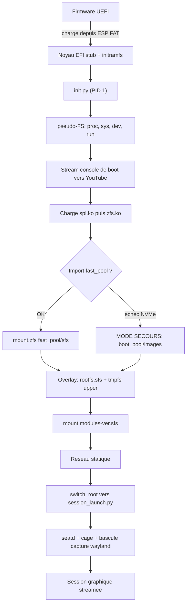
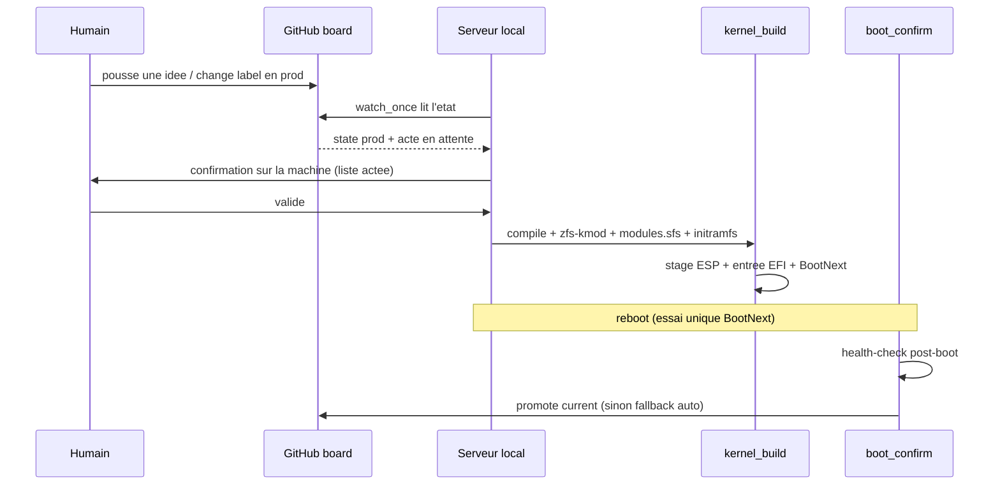

# Boot ZFS + stream YouTube — appliance Gentoo (100% Python)

Système minimal qui boote en **UEFI direct** (EFI stub, sans ZFSBootMenu) sur un
noyau dont l'**initramfs est piloté par Python** : il importe un pool ZFS, monte
un rootfs Gentoo en **squashfs + overlay**, configure le **réseau statique très
tôt**, **stream** le framebuffer puis Wayland vers YouTube, et expose une
**boucle d'auto-update du noyau** pilotée par un LLM local (**Ollama**) avec
garde-fou de boot.

Tous les scripts sont en **Python**. `/init` lui-même est un programme Python
(via `ctypes` pour `mount`/`finit_module`/loop/`switch_root`) ; aucun shell sur
le chemin de boot normal (busybox n'est embarqué que comme secours).

## Matériel cible

- CPU **Intel i5-11400** (Rocket Lake, 6c/12t, AVX-512 VNNI si activé au BIOS)
- iGPU **UHD 730** (`8086:4c8b`) piloté par **xe** (`force_probe=4c8b`), **i915** en repli
- NIC **Realtek r8169** + **REALTEK_PHY** en dur
- **ZFS** en module hors-arbre (CDDL — jamais `=y`)
- 128 Go DDR4, 2 NVMe en stripe — pas de NPU, l'inférence vise le CPU

## Fonctionnement (schémas)

### Séquence de boot



### Les trois sous-systèmes et leurs fichiers

```mermaid
flowchart LR
    subgraph BOOT["Chemin de boot (critique)"]
        I1["init.py"] --> S1["session_launch.py"]
        BI["build_initramfs.py"] -.->|"construit"| I1
    end
    subgraph UPD["Auto-update noyau"]
        KD["kernel_diagnose.py"] --> KW["kernel_watch.py"]
        KW --> CD["config_delta.py"]
        KW --> CH["config_history.py"]
        KW --> KB["kernel_build.py"]
        KB --> BC["boot_confirm.py"]
        KB --> KR["kernel_registry.py"]
        BC --> KR
    end
    subgraph INF["Inference / RAG / brainstorm"]
        OV["ov_pipelines.py"] --> RAG["rag.py"]
        RAG --> BS["brainstorm.py"]
        BS --> GB["github_board.py"]
    end
    KW -.->|"LLM"| OV
    KD -.->|"LLM"| OV
```



### Boucle compile → boot → promotion (pilotée depuis GitHub)



---

## Disposition ZFS

Trois pools, avec des niveaux de redondance **très différents** — c'est
structurant pour la sécurité des données :

| Pool | Type | Survit à | Rôle |
|---|---|---|---|
| `boot_pool` | mirror SATA (5 disques) | 4 disques | master rootfs/init + `boot_pool/manager` (index) + déploiement |
| `data_pool` | raidz2 SATA | 2 disques | `home`, modèles, `archives` (snapshots), `log` (réplication) |
| `fast_pool` | **stripe** 2×NVMe | **0 disque** | rootfs de travail, overlays, sfs, logs (rapide, **fragile**) |

> **`fast_pool` est un stripe (RAID0) : aucune redondance.** Si un seul NVMe
> lâche, **tout `fast_pool` est perdu et irrécupérable** (pas de parité). Tout
> ce qui doit survivre doit donc avoir un master/réplica sur `boot_pool` ou
> `data_pool`. Les snapshots *locaux* de `fast_pool` ne protègent pas d'une
> panne disque : il faut un `zfs send` vers `data_pool/archives`.

Datasets principaux :
```
boot_pool/images        rootfs.sfs MASTER (déployé en strip sur les NVMe)
boot_pool/manager       index/historique du gestionnaire (durable, git-friendly)
fast_pool/sfs           rootfs.sfs (travail) + modules-<ver>.sfs
fast_pool/rootfs        overlay racine (upper) — PERDU si un NVMe lâche
fast_pool/log           /var/log persistant (rapide)
data_pool/log           réplication durable des logs (zfs send depuis fast_pool)
data_pool/home          données, modèles (10 To+)
data_pool/archives      snapshots / sauvegardes (cible des zfs send)
```

Le firmware UEFI ne lit pas ZFS : noyau et initramfs sont **stagés sur l'ESP
FAT32**. Les **deux ESP** (`nvme0n1p1`, `nvme1n1p1`, tenues en phase par rsync)
permettent de booter sur l'autre disque depuis le BIOS si l'un meurt.

### Mode dégradé (lecture seule + réparation)

Deux situations déclenchent le mode dégradé, **sans jamais écrire sur un dataset
suspect** (upper = tmpfs jetable) :

- **`fast_pool` absent** (NVMe en panne — stripe perdu) : `init.py` bascule sur
  `boot_pool/images/rootfs.sfs`.
- **`fast_pool` importé mais un overlay corrompu** (`fast_pool/rootfs` ou `var`
  existe mais ne se monte pas / non inscriptible) : le dataset suspect **n'est
  pas monté**, on garde le rootfs.sfs en lower + un upper tmpfs.

Dans les deux cas : système **utilisable mais volatile** (rien de persistant
écrit), un rapport est posé dans `/etc/degraded-report`, et `session_launch.py`
détecte `/etc/rescue-mode` → **affiche le rapport** (console + stream YouTube) et
ouvre un **shell de réparation** au lieu de la session normale. Le stream de
l'initramfs n'est pas coupé : le rapport reste visible à distance.

Distinction importante : un dataset **absent** (1er boot, pas encore créé) n'est
PAS une corruption → simple tmpfs, pas de bascule réparation. Seul un dataset
**existant mais inutilisable** déclenche le dégradé.

> La survie des overlays suppose une réplication `zfs send` vers
> `data_pool/archives` + une remontée **manuelle**. Sans réplication, l'upper
> est perdu à la panne NVMe (mais le système reboote en dégradé, réparable).

### Changement de rootfs.sfs sous un upper persistant

Piège réel avec un upper **persistant** (système mutable) : l'upper ne contient
que les **diffs** par rapport au `rootfs.sfs` (lower) qui l'a engendré. Si on
repackage un nouveau `rootfs.sfs` en gardant l'ancien upper, des fichiers
obsolètes de l'upper **masquent silencieusement** les nouveaux du sfs (et les
whiteouts périmés cachent des fichiers réintroduits) → système incohérent.

`init.py` gère ça automatiquement via le **CRC32** (zlib, streaming) du
`rootfs.sfs`, comparé au marqueur `.sfs-crc` stocké dans l'upper :
- marqueur absent (1er boot) → on le pose, upper neuf ;
- CRC identique → upper réutilisé tel quel ;
- **CRC différent (sfs changé)** → upper périmé : `init.py` **snapshote** l'ancien
  upper (`fast_pool/rootfs@presfs-<crc>-<ts>`), l'**envoie vers
  `data_pool/archives`** (durable), puis **vide le contenu** de l'upper (pas le
  dataset → xattr/acl conservés) et repose le marqueur. Les modifs repartent
  proprement du nouveau sfs.

CRC32 (et non SHA-256) : on détecte un *changement*, pas une attaque ; c'est
rapide (accéléré SSE4.2 sur le i5) et suffisant. Récupérer un ancien upper
snapshoté est **manuel** (dans `data_pool/archives/rootfs-presfs-<crc>`).

> **En pratique, `rootfs.sfs` change rarement.** Les mises à jour courantes
> portent sur le **noyau et les modules** (`/usr/src` → nouveau
> `modules-<ver>.sfs`), suivies par le registre + l'historique de config
> incrémentale — *pas* par l'overlay. `modules-<ver>.sfs` est monté en lecture
> seule par version (jamais d'upper), donc aucun risque de péremption pour lui.
> Le `rootfs.sfs` n'est repackagé que lors d'un `emerge world` délibéré ; le
> garde-fou CRC32 ne se déclenche que ce jour-là. L'upper persistant
> `fast_pool/rootfs` sert surtout à conserver les ajustements *runtime* entre
> deux boots, pas à appliquer les mises à jour.

---

## Création des datasets (par type)

Règles ZFS à connaître avant de créer :
- **Les propriétés s'héritent** : posées sur le pool ou un parent, elles
  s'appliquent à tout ce qui est en-dessous. On pose donc les valeurs communes
  haut, et on surcharge par dataset.
- **Une propriété ne s'applique qu'aux écritures *suivantes*** — il faut la poser
  **à la création**, pas après coup (sinon les fichiers déjà écrits gardent
  l'ancienne valeur). `casesensitivity` et `normalization` sont **figés** à la
  création.
- `xattr=sa` + `acltype=posixacl` : nécessaires partout où le rootfs porte des
  ACL/capabilities/contextes (overlays, rootfs de secours), et plus performants
  que les xattr « directory ».

### Réglages hérités (une fois, au niveau pool)

```sh
# valeurs communes posees haut -> heritees par tous les datasets crees ensuite
zfs set atime=off          fast_pool
zfs set xattr=sa           fast_pool
zfs set acltype=posixacl   fast_pool
zfs set compression=zstd   fast_pool   # surcharge en off pour les .sfs (cf. plus bas)
zfs set atime=off xattr=sa acltype=posixacl compression=zstd boot_pool
zfs set atime=off xattr=sa acltype=posixacl compression=zstd data_pool
```

### Par type de dataset

```sh
# --- 1. Stockage de .sfs (deja compresses) : PAS de double compression -------
zfs create -o compression=off -o recordsize=1M \
           -o mountpoint=/fast_pool/sfs              fast_pool/sfs
#   recordsize=1M : gros fichiers .sfs lus sequentiellement ; compression=off
#   car squashfs est deja en zstd.

# --- 2. Overlays PERSISTANTS (montes par init.py au boot) --------------------
# upper de l'overlay racine -> systeme mutable et persistant entre les boots.
zfs create -o compression=zstd -o xattr=sa -o acltype=posixacl \
           -o mountpoint=/fast_pool/rootfs           fast_pool/rootfs
# /var lui-meme reste DANS l'overlay rootfs (pas de dataset separe). Seul
# /var/log est persistant (journaux qui survivent aux reboots) :
zfs create -o compression=zstd -o recordsize=128K \
           -o mountpoint=/fast_pool/log              fast_pool/log
#   rootfs = upper de l'overlay ; log monte sur /var/log (/var vient de l'overlay).
#   init.py les monte automatiquement (sautes en mode secours -> tmpfs).
#   /tmp reste un tmpfs volatile : PAS de dataset (ephemere par nature).

# --- 2bis. Sources du noyau (build) : dataset dedie, monte sur /usr/src ------
zfs create -o compression=zstd -o atime=off \
           -o mountpoint=/fast_pool/usr-src          fast_pool/usr-src
#   init.py le monte sur NEWROOT/usr/src : les sources + l'arbre de build
#   PERSISTENT entre les boots (pas de recompilation complete a chaque fois).
#   emerge installe les sources la ; kernel_build.py compile la.

# --- 3. Logs : replica durable -----------------------------------------------
zfs create -o compression=zstd -o recordsize=128K \
           -o mountpoint=/data_pool/log              data_pool/log   # replica durable

# --- 4. boot_pool (mirror SATA, durable) : masters + restauration ------------
zfs create -o compression=off \
           -o mountpoint=/boot_pool/images           boot_pool/images   # rootfs.sfs master
zfs create -o compression=zstd \
           -o mountpoint=/boot_pool/manager          boot_pool/manager  # index (git-friendly)
zfs create -o compression=zstd \
           -o mountpoint=/boot_pool/efi-backup        boot_pool/efi-backup
#   efi-backup : copie des DEUX ESP (vmlinuz, initramfs, entrees) pour
#   restaurer une partition FAT corrompue ou re-deployer un NVMe remplace.
#   boot_pool contient aussi une copie kernel+initrd de secours (source du
#   mode degrade via boot_pool/images).

# --- 5. Donnees & archives (data_pool, raidz2) -------------------------------
zfs create -o compression=zstd -o recordsize=1M \
           -o mountpoint=/data_pool/home             data_pool/home     # modeles, data
zfs create -o compression=zstd \
           -o mountpoint=/data_pool/archives         data_pool/archives # cible zfs send

# --- 6. Reserve d'espace (20% de fast_pool a ne jamais remplir) --------------
#   Plutot qu'un dataset vide (grignotable), une refreservation au niveau pool :
zfs create -o refreservation=200G -o mountpoint=none fast_pool/reserve
#   (ajuste 200G selon 20% de ta capacite reelle de fast_pool)
```

### Type de montage (qui monte quoi, et quand)

| Dataset | Monté par | Type |
|---|---|---|
| `fast_pool/sfs`, `boot_pool/images` | `init.py` (initramfs) | `mount.zfs` explicite, **pas** d'auto-mount |
| `fast_pool/rootfs` (upper) | `init.py` | upper de l'overlay racine (persistant) |
| `fast_pool/log`, `fast_pool/usr-src` | `init.py` | `mount.zfs` sur `NEWROOT/{var/log,usr/src}` (`/var` vient de l'overlay) |
| `boot_pool/manager`, `data_pool/*` | système booté (OpenRC) | auto-mount ZFS standard (mountpoint) |

> En **mode secours** (fast_pool absent), `init.py` saute tous les datasets
> `fast_pool/*` : upper = tmpfs volatile, pas de var/log/usr-src persistants.
> Le système de secours est minimal et éphémère, par conception.

> `init.py` importe les pools avec `zpool import -N` (**`-N` = ne monte aucun
> dataset automatiquement**) puis fait des `mount.zfs` explicites : le boot
> contrôle exactement l'ordre et les cibles. Les datasets en `mountpoint=...`
> qui ne sont PAS sur le chemin de boot (`boot_pool/manager`, `data_pool/*`)
> sont montés normalement par le service ZFS une fois le système démarré.

> `mountpoint=none` (ex. `fast_pool/reserve`) = jamais monté, sert juste à
> réserver/organiser. `mountpoint=legacy` = monté via `/etc/fstab` ou
> `mount -t zfs` manuel (on ne l'utilise pas ici, on préfère `mount.zfs`
> explicite dans `init.py`).

---

## Arborescence du projet

Trois sous-systèmes indépendants. Seul le premier est sur le **chemin de boot
critique** (un échec = kernel panic / pas de boot) ; les deux autres sont de
l'espace utilisateur (un échec = fonctionnalité absente, jamais de panic).

```
.
├── README.md
│
├── common.py             # SOCLE userspace : sh() unifie + helpers ZFS partages
│                         #   + Result observable + is_true + ConfigView.
│                         #   JAMAIS importe par le chemin de boot (init reste autonome)
├── boot_layout.py        # source de verite des ESP : distingue install_mount
│                         #   (echafaudage) de l'identite finale (PARTUUID) ; garde anti-/boot
│
│  ── BOOT (chemin critique) ──────────────────────────────────────────
├── init.py               # PID 1 de l'initramfs (ctypes) — installé comme /init
│                         #   pseudo-FS → charge zfs → import pool → santé →
│                         #   overlay squashfs → réseau → stream → switch_root
├── build_initramfs.py    # construit initramfs-<ver>.zst : CPython + busybox +
│                         #   zpool/zfs/mount.zfs/ip + famille zfs.ko + firmware
├── initramfs_verify.py   # verifie le contenu d'un initramfs (sans booter) +
│                         #   checksums SHA-256 + manifeste d'integrite
├── sfs_build.py          # cree rootfs.sfs + modules-<ver>.sfs (staging tmpfs,
│                         #   nettoyage, controle) -- appele par first_boot/kernel_build
├── clean_rootfs.py       # prepare une racine Gentoo PROPRE sur une COPIE (rsync
│                         #   -aHAX) avant de figer en rootfs.sfs (jamais automatique)
├── uki_build.py          # UKI multi-profils (vmlinuz+initramfs+cmdline via objcopy)
│                         #   sur les 2 ESP + fallback BOOTX64.EFI ; pilote par [uki]
├── zfs_mounts.py         # detection/verification/montage de datasets (ismount +
│                         #   /proc/mounts + contenu) -- distingue 'monte' de 'dossier vide'
├── validate_boot.py      # valide SFS (montable + contenu) et ESP (vfat + place)
│                         #   avant de compter dessus -- module commun
├── zfs_replicate.py      # replication incrementale (zfs send -i) fast_pool/log
│                         #   -> data_pool/log (durable) ; rotation des snapshots
├── session_launch.py     # post-switch_root (PID 1 du rootfs) : seatd + cage +
│                         #   bascule du stream fbdev → capture wayland
├── efi_install.py        # install EFI initiale (un seul noyau, manuel)
├── first_boot.py         # orchestrateur first-boot (chroot) : verifie infra +
│                         #   compile + initramfs + EFI + rapport + autorisation git
├── infra.conf            # declaration de l'infrastructure VOULUE (a editer)
│
│  ── AUTO-UPDATE DU NOYAU (espace utilisateur) ───────────────────────
├── kernel_diagnose.py    # étape 0 : diagnostic de cohérence au démarrage
│                         #   (.config + dmesg + lsmod + health.json), non bloquant
├── kernel_watch.py       # étape 1 : veille amont (tags git) + nouveaux symboles
│                         #   Kconfig → propositions LLM → validation → fragment
├── config_delta.py       #   comparaison catégorisée de .config + ce qu'olddefconfig
│                         #   change tout seul (point aveugle comblé)
├── config_history.py     #   archivage versionné des configs + doc/raisons + SVG
├── kernel_build.py       # étape 2 : compile + garde-fou zfs.ko + modules.sfs +
│                         #   initramfs + stage ESP + entrée EFI + BootNext
├── boot_confirm.py       # étape 3 : health-check post-boot + promotion BootOrder
├── kernel_registry.py    #   index des versions : dataset ZFS/version + manifeste
│                         #   kernels.json + audit de cohérence (menage manuel)
│
│  ── INFÉRENCE / RAG / BRAINSTORM (espace utilisateur, OpenVINO) ──────
├── ov_pipelines.py       # registre de pipelines par métaclasse (auto-enregistrement)
│                         #   + back-ends interchangeables (OpenVINO prod / Stub test)
├── rag.py                # RAG multi-domaines : chunking, index, recherche+rerank
├── brainstorm.py         # fiche idée (3 couches : candidats/acté/état) + moteur
├── github_board.py       # pont board GitHub ↔ idées (Issues, REST) + watcher prod
├── github_project.py     # pont GitHub Projects v2 (GraphQL) : items = idées,
│                         #   statut = colonne ; déclencheur colonne OU label
├── test_github.py        # valide le pont Issues REST en réel (avant tout le reste)
└── test_project.py       # valide le pont Projects v2 GraphQL en réel
```

Fichiers déployés **dans le rootfs Gentoo** (cf. §5) :

```
/sbin/session_launch.py              # depuis session_launch.py
/usr/local/sbin/boot_confirm.py      # depuis boot_confirm.py
/etc/init.d/stream-session           # service OpenRC
/etc/init.d/boot-confirm             # service OpenRC
```

> **État de maturité (à lire avant de booter).** Tout a été testé *en
> isolation* (parsing, logique), jamais sur le matériel cible ni avec OpenVINO
> réel. Le bloc inférence/RAG/brainstorm tourne avec un back-end *stub* sans
> OpenVINO ; brancher `openvino_genai` nécessitera de vérifier les noms de
> méthode GenAI (isolés dans `ov_pipelines.OpenVINOBackend`). Le premier boot
> reste un test réel — d'où le filet `BootNext`/`BootOrder` (§ auto-update).

---

## 1. Système Gentoo — `make.conf`

```sh
# /etc/portage/make.conf
COMMON_FLAGS="-O2 -march=native -pipe"   # native -> AVX-512 VNNI si dispo (gain inférence CPU)
MAKEOPTS="-j12"                          # 6c/12t
VIDEO_CARDS="intel iris"                 # iris = Mesa GL Gen12 ; intel = Vulkan ANV
USE="vaapi wayland vulkan -X"
ACCEPT_KEYWORDS="amd64"
ACCEPT_LICENSE="* -@EULA"                # CDDL (zfs) + firmware redistribuable
```

> `lscpu | grep avx512` pour confirmer l'AVX-512 (BIOS-dépendant sur Rocket Lake).
> Après changement de flags : `emerge -e @world` (ou au moins recompiler `ollama`,
> `mesa`, `ffmpeg`, les modules noyau et `python`).

## 2. Overlay GURU + keywords / USE

```sh
eselect repository enable guru
emaint sync -r guru
```
```sh
# /etc/portage/package.accept_keywords/ai
sci-ml/ollama ~amd64

# /etc/portage/package.use/ai
sci-ml/ollama -cuda                       # Intel : PAS de cuda (évite le bug acct-user)
media-video/ffmpeg vaapi x264 opus vorbis
```

## 3. Paquets

```sh
# Boot / ZFS / EFI / outils initramfs
emerge -av sys-fs/zfs sys-fs/zfs-kmod sys-boot/efibootmgr \
           sys-fs/squashfs-tools app-arch/zstd app-arch/cpio \
           sys-apps/busybox sys-kernel/linux-firmware   # rtl_nic + GuC/HuC (xe)

# clang/LLVM requis par la chaine OpenCL Intel (intel-graphics-compiler ->
# opencl-clang -> llvm-core/clang). Categorie deplacee sys-devel -> llvm-core,
# paquets slottes. Le USE static-analyzer (actif par defaut) est obligatoire
# sur clang, sinon erreurs de linker au build d'opencl-clang :
echo "llvm-core/clang static-analyzer pie extra" >> /etc/portage/package.use/ai
emerge -av llvm-core/clang llvm-core/llvm
# USE=clang reste DESACTIVE par defaut sur profil non-LLVM (GCC continue a
# servir de compilateur systeme) -- seul le binaire clang est requis ici.

# iGPU : OpenCL + Level Zero (NEO) + VAAPI media
emerge -av dev-libs/intel-compute-runtime dev-libs/level-zero \
           media-libs/libva-intel-media-driver media-libs/libva
# le driver media s'appelle iHD ; libva charge l'ancien par defaut sans ca :
echo 'LIBVA_DRIVER_NAME="iHD"' >> /etc/env.d/90intel-media
env-update && source /etc/profile

# Session graphique + capture/stream
emerge -av gui-wm/cage sys-auth/seatd gui-apps/foot \
           gui-apps/wf-recorder media-video/ffmpeg
# wl-screenrec (préféré, VAAPI Intel) : GURU ou `cargo install wl-screenrec`

# Inférence
emerge -av sci-ml/ollama
# numpy : requis par rag.py (recherche vectorielle). Repli pur-Python existe
# mais numpy est fortement recommande (perf).
emerge -av dev-python/numpy
# configobj : requis par first_boot.py (lecture de infra.conf)
emerge -av dev-python/configobj
```

> `python3` (et donc `ctypes`) est déjà fourni par `dev-lang/python` sur Gentoo —
> rien à installer en plus pour les scripts du **boot**.

> **Bloc inférence/RAG/brainstorm** (`ov_pipelines.py`, `rag.py`, `brainstorm.py`,
> `github_board.py`) : OpenVINO GenAI n'est pas packagé sur Gentoo — il s'installe
> dans un venv dédié (cf. § OpenVINO). Tant qu'il est absent, le back-end *stub*
> prend le relais (`RAG_BACKEND=stub`) et tout reste fonctionnel pour le
> développement, sans inférence réelle. `github_board.py` n'a besoin que de la
> stdlib (+ un `GITHUB_TOKEN` pour le transport réel).

## 4. Accès GPU + service Ollama

```sh
usermod -aG render,video <utilisateur>     # /dev/dri (compositeur + compute)

rc-update add ollama default
rc-service ollama start                    # API sur http://127.0.0.1:11434
ollama pull qwen3:30b                       # tag exact à vérifier via `ollama list`
```

## 5. Déploiement des scripts dans le rootfs

À faire dans le rootfs Gentoo **avant** de générer `rootfs.sfs` :

```sh
install -m 0755 session_launch.py /sbin/session_launch.py
install -m 0755 boot_confirm.py   /usr/local/sbin/boot_confirm.py
```

Services OpenRC (le `/init` Python fait `switch_root` vers `/sbin/init` si tu
actives OpenRC — voir §10) :

```sh
# /etc/init.d/stream-session
#!/sbin/openrc-run
command="/usr/bin/python3"
command_args="/sbin/session_launch.py"
command_background="yes"
pidfile="/run/stream-session.pid"
depend() { after udev; }
```
```sh
# /etc/init.d/boot-confirm
#!/sbin/openrc-run
command="/usr/bin/python3"
command_args="/usr/local/sbin/boot_confirm.py"
depend() { after stream-session; }
```
```sh
rc-update add stream-session default
rc-update add boot-confirm  default
```

## 6. Noyau — `.config`

```
# Built-in
CONFIG_EFI=y, CONFIG_EFI_STUB=y
CONFIG_BINFMT_SCRIPT=y                   # exécuter /init via son shebang python
CONFIG_BLK_DEV_NVME=y, CONFIG_SATA_AHCI=y
CONFIG_SQUASHFS=y, CONFIG_SQUASHFS_ZSTD=y, CONFIG_SQUASHFS_XATTR=y
CONFIG_OVERLAY_FS=y, CONFIG_BLK_DEV_LOOP=y
CONFIG_DEVTMPFS=y, CONFIG_DEVTMPFS_MOUNT=y, CONFIG_TMPFS=y
CONFIG_DRM=y, CONFIG_DRM_XE=y, CONFIG_DRM_XE_DISPLAY=y
CONFIG_DRM_XE_FORCE_PROBE="4c8b"
CONFIG_DRM_I915=y                        # repli
CONFIG_FB=y, CONFIG_FRAMEBUFFER_CONSOLE=y, CONFIG_VT=y
CONFIG_DRM_FBDEV_EMULATION=y             # cree /dev/fb0 (capture fbdev du stream)
CONFIG_DRM_SIMPLEDRM=y, CONFIG_SYSFB_SIMPLEFB=y  # framebuffer EFI tres tot (boot)
CONFIG_R8169=y, CONFIG_REALTEK_PHY=y     # PHY en dur OBLIGATOIRE avec r8169=y
CONFIG_IP_PNP=y                          # réseau configuré avant l'userspace
CONFIG_FW_LOADER=y
CONFIG_RD_ZSTD=y                         # décompression de l'initramfs .zst

# Dépendances NOYAU de ZFS — DOIVENT être =y (en dur), sinon zfs.ko ne charge
# pas (finit_module ne résout pas les symboles manquants -> panic à l'étape 2).
# init.py charge zfs via finit_module SANS modprobe : aucune dépendance =m ne
# sera auto-chargée. D'où l'obligation du =y ci-dessous.
CONFIG_ZLIB_INFLATE=y, CONFIG_ZLIB_DEFLATE=y
CONFIG_CRYPTO=y, CONFIG_CRYPTO_DEFLATE=y
CONFIG_CRYPTO_SHA256=y, CONFIG_CRYPTO_SHA512=y
CONFIG_CRC32=y, CONFIG_CRC32C=y          # checksums ZFS (crc32c) -- en dur
CONFIG_CRYPTO_CRC32C_INTEL=y             # crc32c accéléré SSE4.2 (gratuit, i5)
CONFIG_CRYPTO_AES=y, CONFIG_CRYPTO_GCM=y  # si pools chiffrés ; sans risque sinon
CONFIG_CRYPTO_AES_NI_INTEL=y             # AES-NI : seulement si datasets chiffrés
# Firmware (rtl_nic + i915 GuC/HuC/DMC) embarqué dans l'initramfs par
# build_initramfs.py -> CONFIG_EXTRA_FIRMWARE inutile (l'initramfs est
# décompressé AVANT les initcalls des drivers =y, donc /lib/firmware est là).

# Modules hors-arbre (chargés par init.py via finit_module, dans l'ordre des
# dépendances découvert par build_initramfs.py : spl -> ... -> zfs)
zfs, spl
```

> `xe` est **GuC-obligatoire** : le firmware GuC/HuC doit être présent quand le
> GPU s'initialise. Ici `build_initramfs.py` les place dans l'initramfs, qui est
> décompressé avant les initcalls — donc rien à embarquer dans le noyau.

Build :
```sh
eselect kernel set linux-<ver>           # /usr/src/linux -> ton arbre
cd /usr/src/linux
make -j"$(nproc)" && make modules_install
emerge -1 sys-fs/zfs-kmod                 # zfs.ko/spl.ko contre ce noyau
```

### Ligne de commande noyau

```
i915.force_probe=!4c8b xe.force_probe=4c8b ip=192.168.1.10::192.168.1.1:255.255.255.0::eth0:off:8.8.8.8 console=tty0 loglevel=4
```

## 7. Générer `rootfs.sfs`

### 7.1 Nettoyage de la racine avant `mksquashfs`

**Méthode sûre (recommandée)** : `clean_rootfs.py` copie le rootfs source vers
un staging fourni (`rsync -aHAX` : préserve xattr/ACL/hardlinks/permissions),
nettoie **la copie**, et laisse le système source **intact**. Jamais automatique,
garde-fous stricts (refuse `/` et les chemins système, refuse source==staging) :

```sh
# le staging doit avoir la place (plusieurs Go) et N'EST PAS un chemin systeme
python3 clean_rootfs.py --source <racine_gentoo> --staging /data_pool/staging
python3 clean_rootfs.py --source <racine> --staging /data_pool/staging --dry-run  # voir sans agir
# puis figer la copie propre :
python3 sfs_build.py --rootfs-src /data_pool/staging
```

Il purge : caches Portage (`var/tmp/portage`, distfiles, binpkgs), logs de build,
`__pycache__`/`.pyc`, `machine-id` (vidé, régénéré au boot), clés SSH hôte
(régénérées), handoff initramfs (`yt.key`, `initramfs-stream.pid`). Il **protège**
`etc/portage`, `var/db/pkg`, `lib/modules`, et les scripts de session. Un
`verify_essentials` avertit si un élément critique manque dans la copie.

**Exclusion des pseudo-FS** (sinon `rsync` copierait des fichiers virtuels comme
`/proc/kcore` = taille de la RAM → blocage) : `clean_rootfs.py` exclut du rsync
`/proc`, `/sys`, `/dev`, `/run`, `/tmp`, `/var/tmp`, `/mnt`, `/media` (avec
`--one-file-system`), puis **recrée ces points de montage VIDES** dans l'image
(l'initramfs/le système les remplit au boot). C'est ce qui évite de figer l'état
volatil de la machine de build dans le rootfs.sfs.

**Méthode manuelle** (équivalente, si tu préfères tout contrôler à la main) :
À faire sur `<racine_gentoo>`
juste avant `mksquashfs` :

```sh
R=<racine_gentoo>

# --- nettoyage Portage propre (avant de figer l'image) ----------------------
# ATTENTION : emerge/eclean agissent sur la base Portage du systeme COURANT
# (/var/db/pkg), pas sur $R directement. Deux cas :
#  - tu construis le rootfs DANS un chroot/conteneur dedie -> lance ces
#    commandes DANS ce chroot (PORTAGE_CONFIGROOT/ROOT pointent dessus par defaut)
#  - tu pars d'une copie de ton systeme courant -> lance-les AVANT de copier
#    vers $R, sur le systeme source, pas apres
#
# 1. paquets orphelins (plus references par @world/dependances)
emerge --depclean -a

# 2. tarballs sources et binpkgs obsoletes/non installes
#    (eclean vient de app-portage/gentoolkit : emerge -av app-portage/gentoolkit si absent)
eclean-dist --deep          # purge var/cache/distfiles (sources .tar.* telechargees)
eclean-pkg  --deep          # purge var/cache/binpkgs (paquets binaires obsoletes)

# 3. residus que depclean/eclean ne couvrent pas, a faire sur $R une fois la
#    copie/le chroot pret : logs de build (souvent plusieurs Go) et arbre
#    Portage legacy si tu es passe a un sync git/squashfs
rm -rf "$R"/var/tmp/portage/*
rm -rf "$R"/usr/portage "$R"/var/db/repos/*/.git 2>/dev/null

# --- logs / etats de session du systeme qui a servi a construire l'image ---
rm -rf "$R"/var/log/*.log "$R"/var/log/*/*.log
rm -f  "$R"/var/lib/portage/world.lock 2>/dev/null
rm -rf "$R"/run/* "$R"/tmp/*

# --- caches Python : __pycache__/.pyc ne doivent pas figer une mauvaise version
find "$R" -name '__pycache__' -type d -prune -exec rm -rf {} +
find "$R" -name '*.pyc' -delete

# --- historiques shell / clefs SSH ephemeres de la machine de build ---
rm -f "$R"/root/.bash_history "$R"/root/.viminfo
rm -rf "$R"/etc/ssh/ssh_host_*        # regeneres au premier boot (ssh-keygen)

# --- machine-id : doit etre regenere, pas figé dans une image partagee ---
rm -f "$R"/etc/machine-id
: > "$R"/etc/machine-id 2>/dev/null || true

# --- handoff initramfs : ne doit pas preexister dans l'image (cf. init.py §...) ---
rm -f "$R"/etc/yt.key "$R"/etc/initramfs-stream.pid "$R"/etc/resolv.conf
```

> Ne supprime **pas** `/etc/portage/` (config), `/var/db/pkg/` (base de
> paquets installes — necessaire pour `emerge` apres pivot si tu veux gerer
> le systeme depuis la session), ni quoi que ce soit sous `/sbin/session_launch.py`,
> `/usr/local/sbin/boot_confirm.py`, `/lib/modules/`.

### 7.2 Vérification des répertoires de montage attendus

`init.py` et `session_launch.py` font des `mount`/`mkdir` sur des chemins
précis de `NEWROOT` (= la racine que tu empaquettes). Vérifie qu'ils
existent (vides, juste les dossiers) **avant** `mksquashfs` — sinon `init.py`
les crée lui-même au boot (`os.makedirs(..., exist_ok=True)`), mais autant
les avoir dans l'image pour éviter toute écriture sur l'overlay dès le
premier montage :

```sh
R=<racine_gentoo>

for d in proc sys dev dev/pts run etc sbin \
         "lib/modules/$(uname -r)"; do
  mkdir -p "$R/$d"
done

# verif rapide : presence des cibles que init.py va peupler/monter sous NEWROOT
for d in proc sys dev run etc "lib/modules/$(uname -r)" sbin; do
  [ -d "$R/$d" ] || echo "MANQUANT: $R/$d"
done

# session_launch.py doit etre present et executable -> sinon init.py
# echoue sur "switch_root: $NEWROOT/sbin/session_launch.py absent"
[ -x "$R/sbin/session_launch.py" ] || echo "MANQUANT/non-executable: $R/sbin/session_launch.py"

# binaires requis par session_launch.py (cage/sway, seatd, ffmpeg, wl-screenrec...)
for b in cage seatd ffmpeg; do
  [ -x "$R/usr/bin/$b" ] || [ -x "$R/usr/sbin/$b" ] || echo "MANQUANT: $b dans le rootfs"
done
```

> Note : `proc`, `sys`, `dev`, `run` sont remontés par `session_launch.py`
> juste après le `switch_root` — seul le **dossier** doit exister dans l'image
> (vide), pas son contenu. `lib/modules/$(uname -r)` : si tu construis sur une
> machine différente de la cible (ou un noyau pas encore booté), remplace
> `$(uname -r)` par la version exacte du noyau cible
> (`make -C /usr/src/linux -s kernelrelease`) — c'est le même nom que
> `modules-<ver>.sfs` que monte `init.py` étape 5.

```sh
zfs mount fast_pool/sfs
mksquashfs <racine_gentoo> $(zfs get -H -o value mountpoint fast_pool/sfs)/rootfs.sfs \
           -comp zstd -xattrs -noappend
```
(la racine doit contenir python3, les paquets §3, et les scripts §5)

**Automatisable** : plutôt que la commande manuelle ci-dessus (souvent oubliée —
c'est ce qui a causé un boot raté faute de `rootfs.sfs`), `sfs_build.py` le fait
avec staging tmpfs `/tmp`, nettoyage et contrôle du fichier final :
```sh
python3 sfs_build.py --rootfs-src <racine_gentoo>           # rootfs.sfs
python3 sfs_build.py --modules <kver>                       # modules-<kver>.sfs
# ou via l'orchestrateur :  first_boot.py --rootfs-src <racine_gentoo>
```

**Staging et cross-device** : `sfs_build` écrit le `.sfs` temporaire en priorité
**dans le dossier de destination** (`fast_pool/sfs`) — même FS → `os.replace`
atomique, zéro erreur cross-device. Si la destination manque de place, il bascule
sur le dataset dédié `fast_pool/staging` (même pool), puis `/var/tmp` en dernier
recours. Plus de staging dans le `/tmp` du chroot. Si jamais le tmp finit sur un
FS différent, la publication se fait par copie vers un `.new` **local** à la
destination puis rename atomique (jamais de `shutil.move` cross-device fragile).

**Refus de figer le système vivant** : `sfs_build` exige que `--rootfs-src` soit
une **copie nettoyée** par `clean_rootfs` (qui y dépose un marqueur
`.cleaned-for-sfs`). Sans ce marqueur, il **refuse** — d'autant plus si la racine
semble vivante (pseudo-FS montés dessous). `--force-live` passe outre
explicitement. Le marqueur lui-même est exclu de l'image. Le rootfs source n'est
jamais modifié (mksquashfs lit seulement), mais figer une racine en service donne
un état incohérent : on l'empêche par défaut.
Si `rootfs.sfs` est **absent au boot**, `init.py` ne fige plus l'écran : il
affiche « IMAGE ROOTFS ABSENTE » et ouvre un shell de secours.

## 8. Construire l'initramfs

`build_initramfs.py` embarque CPython (interpréteur + stdlib allégée + `.so` via
`ldd`), busybox (secours), `zpool`/`zfs`/`mount.zfs`/`ip`, décompresse la
**famille `zfs.ko`** (ordre de dépendances découvert via `modinfo`, écrit dans
`zfs_load_order`), copie les firmware (`rtl_nic` + `i915/tgl_*`/`rkl_*` pour
GuC/HuC/DMC — Rocket Lake réutilise les blobs Tiger Lake), crée les nœuds
`/dev`, embarque **ffmpeg statique** (stream console de boot), et installe
`init.py` comme `/init`.

> Prérequis : `sys-kernel/linux-firmware` doit être installé sur la machine de
> build (les blobs sont lus depuis `/lib/firmware/`). Les motifs sont
> surchargeables via `FW_GLOBS`.

> **Piège Gentoo `python-exec`** : sur Gentoo, `/usr/bin/python3` est un
> **wrapper** (`python-exec2c`) qui délègue au vrai interpréteur, dont il a
> besoin de trouver l'écosystème (`/usr/lib/python-exec/`) ET la variable
> **`EPYTHON`**. Distinguer wrapper et vrai binaire à travers les liens Gentoo
> s'est révélé peu fiable. **Solution retenue : embarquer TOUT l'écosystème** —
> le wrapper, tous les `python3*` de `/usr/bin`, l'intégralité de
> `/usr/lib/python-exec/`, `python-exec2c`, les vrais binaires versionnés et
> leurs `.so` (dont **`libpython3.X.so.1.0`** car Gentoo compile en SHARED). On
> reproduit l'environnement Gentoo tel quel.
>
> **`/init` est un lanceur shell** (`#!/bin/busybox sh`), pas directement
> `init.py`. Raison : le noyau lance `/init` avec un environnement **minimal**
> (`HOME=/ TERM=linux`) — donc `EPYTHON` n'est pas défini et le wrapper
> échouerait (« no python-exec wrapper found »). Le lanceur **exporte `EPYTHON`,
> `PATH`, `LD_LIBRARY_PATH`** puis `exec /usr/bin/python3 /init.py`. Bonus : si
> python échoue, le lanceur l'affiche sur `/dev/kmsg` et tombe sur un shell —
> plus de panic muet.
>
> **Auto-test** : `chroot <stage> /usr/bin/python3 -c "import ctypes,..."` avec
> `EPYTHON` défini (exactement comme au boot) ; le build s'arrête si python ne
> démarre pas.
>
> **Liens SONAME** : `ldd` donne `libpython3.14.so.0 => /usr/lib64/libpython3.14.so.1.0`.
> Le binaire cherche le **SONAME** (`.so.0`), le fichier réel a un autre nom
> (`.so.1.0`). `build_initramfs` copie le fichier réel **et recrée le lien
> SONAME** ; sans ça le loader ne trouve pas la lib au boot et python ne démarre
> pas. (Les libs Gentoo sont dans `/usr/lib64`.)
>
> **Libs chargées dynamiquement (`libgcc_s.so.1`, `libresolv.so.2`)** : certaines
> libs ne sont PAS listées par `ldd` car chargées à l'exécution via `dlopen` ou
> NSS — **`libgcc_s.so.1`** (threads Python : « libgcc_s.so.1 must be installed
> for pthread_exit to work »), **`libresolv.so.2`** + `libnss_*` (résolution
> réseau pour busybox et python). `build_initramfs` les embarque **explicitement**
> (`bundle_critical_libs`), **avec toute la chaîne de liens SONAME** (ex
> `libresolv.so → libresolv.so.2`), **et les copie dans `/usr/lib64`** (un chemin
> du `LD_LIBRARY_PATH`). Crucial : sur Gentoo, `libgcc_s.so.1` vit dans
> `/usr/lib/gcc/<triplet>/<ver>/`, **hors** du chemin de recherche du loader —
> sans recopie dans `/usr/lib64`, la lib est dans l'initramfs mais **introuvable**
> au runtime. Deux auto-tests au build : `busybox true` (charge ses
> `.so`) et python+thread — le build s'arrête si une lib manque.
>
> **`break=launcher`** : un shell s'ouvre dans le lanceur **avant** python — un
> filet de debug qui marche même si python est cassé (contrairement à
> `break=<etape>` qui est dans init.py donc nécessite que python démarre).
>
> **Import des pools** : `init.py` fait `zpool import -N -f <pool>` (comme un
> import manuel qui marche), **sans** `-d /dev`. Le `-d /dev` restreignait le
> scan aux devices de `/dev` uniquement ; le laisser par défaut permet à ZFS de
> scanner tous les chemins (partitions, by-id…), comme `zpool import -f -N` en
> ligne de commande. `-N` = importer sans monter (init.py monte ensuite via
> `mount.zfs` explicite, canonique pour `mountpoint=legacy`).
>
> **Import RAPIDE (`-d` ciblé)** : scanner tout `/dev` au boot prenait ~37 s/pool
> (il inclut l'ISO live, toutes les partitions…). `import_pool` cible
> `/dev/disk/by-id` puis `/dev/disk/by-partuuid` (ne contiennent que les
> partitions réelles) → import quasi instantané. Repli sur `/dev` si ces dossiers
> manquent.
>
> **Montage gérant `mountpoint != legacy`** : `fast_pool/sfs`
> (`mountpoint=/fast_pool/sfs`) **et** `fast_pool/rootfs`
> (`mountpoint=/fast_pool/rootfs`) ne sont **pas** `legacy`, donc un
> `mount.zfs <ds> <cible>` direct échouait (« existe mais ne se monte pas »,
> faussement attribué à une corruption). `mount_zfs_dataset` ajoute `-o zfsutil`
> pour les datasets non-legacy → monte à la cible quel que soit le mountpoint.
> **Tous** les montages d'init.py (sfs, upper de l'overlay, secours, récursif)
> passent par cette fonction.
>
> **`data_pool` importé + montage récursif ORDONNÉ** : `data_pool` (home, log,
> archives) est désormais importé et monté sous `NEWROOT` via
> `mount_pool_recursive`, qui trie les datasets par profondeur (**parent monté
> avant enfant** : `boot_pool` avant `boot_pool/images`) et **saute** un dataset
> dont le parent a échoué. `mountpoint=none` = conteneur, rien à monter.
>
> **Garde overlay** : avant d'assembler l'overlay racine, init.py vérifie que
> `/mnt/sfs` est un **vrai point de montage** (`os.path.ismount`), pas un
> répertoire vide — sinon l'overlay s'appuierait sur un lower fantôme. Si une
> dépendance manque, on s'arrête proprement avec un message au lieu d'un système
> cassé en silence.
>
> **Détection ffmpeg statique FIABLE** : l'ancien test parsait le texte de `ldd`
> (« not a dynamic executable »), **traduit en français** → faux positif.
> `_is_dynamic_elf` lit désormais l'**en-tête ELF** et cherche un segment
> `PT_INTERP` (interpréteur dynamique). Absent = statique. Langue-indépendant.
>
> **`zpool upgrade` (warning bénin)** : `zpool status` signale que des features
> ne sont pas activées sur les pools (créés avec une version ZFS antérieure). Le
> pool **fonctionne normalement** ; c'est un avertissement, pas une erreur. Lance
> `zpool upgrade <pool>` si tu veux activer les features récentes (attention :
> le pool ne sera plus accessible par une version ZFS plus ancienne).
>
> **`clean_rootfs.py` ne supprime PAS les essentiels** : `etc/portage`,
> `var/db/pkg`, `lib/modules`, `sbin/session_launch.py`,
> `usr/local/sbin/boot_confirm.py` sont dans `PROTECTED` (jamais touchés). Seuls
> des résidus de build sont purgés (`var/tmp/portage`, caches distfiles/binpkgs,
> `usr/portage` legacy, logs, machine-id…). En **dry-run**, la copie n'a pas
> lieu donc le staging est vide ; la vérification des essentiels se fait alors
> dans la **source** (plus de faux « absent de la copie »).
>
> **Datasets montés dans le rootfs (`--one-file-system`)** : `rsync` utilise
> `--one-file-system` pour ne pas traverser `/mnt`, `/proc`… mais cela
> **sauterait** aussi les datasets ZFS montés dans le rootfs (ex `/var/db/pkg`,
> `/etc/portage` sur Gentoo). `clean_rootfs` les **détecte** (`findmnt`, via
> `submounts_under`) en filtrant les pseudo-FS et montages externes, puis les
> **copie explicitement** un par un. Sans ça, ces données manqueraient
> silencieusement du `rootfs.sfs`.

> **switch_root : déplacer les pseudo-FS** (leçon de debug réel) : avant de
> basculer sur le nouveau root, init.py **déplace** (`MS_MOVE`) `/dev`, `/proc`,
> `/sys`, `/run` vers `NEWROOT`. Sans ça, le nouveau `/` a un `/dev` **vide** →
> pas de `/dev/null` → `python`/`session_launch.py` échoue (« /dev/null: no such
> file or directory ») → PID 1 meurt → **kernel panic**. C'est ce que fait le
> vrai `switch_root` en interne. Filet supplémentaire : `/dev/null` est recréé
> via `mknod` si devtmpfs est incomplet.

> **Déploiement des scripts appliance dans le rootfs** (cause racine des
> confusions de version) : `session_launch.py` et `boot_confirm.py` vivent
> **dans le rootfs Gentoo**, figé dans `rootfs.sfs`. Les livrer ailleurs ne les
> met PAS dans le rootfs → le sfs figerait une **ancienne** version (ex : le
> panic cage avec `execvp` alors que le fix était corrigé). `sfs_build`
> **déploie** maintenant ces scripts (`deploy_appliance_scripts`) depuis un
> répertoire de référence (`--appliance-ref`, défaut = dossier de first_boot)
> vers le rootfs **avant** `mksquashfs`. Et `first_boot` recrée le sfs par défaut
> (`--no-force-sfs` pour l'éviter) afin que le déploiement prenne effet. Sans ça,
> on débugge éternellement du vieux code figé.
>
> **PID 1 résilient (compositeur)** : `session_launch.py` ne fait **plus**
> `execvp("cage")` direct. Il **boucle** sur le compositeur : que cage se termine
> **proprement** (tu fermes foot) ou **échoue**, PID 1 ne meurt jamais (sinon
> kernel panic). Sortie propre → relance ; échec → nouvelle tentative, et après 3
> échecs consécutifs → shell de maintenance (puis re-tentative). Cause typique du
> « unable to create the wlroots backend » : `nomodeset` (profil `safe`) → pas de
> KMS → pas de `/dev/dri/card0`. Pour l'affichage, boote un profil **avec** KMS
> (i915/normal).
>
> **Orchestration des services (`[services]` dans infra.conf)** : après le
> switch_root, `session_launch.start_services()` démarre les services OpenRC
> listés dans la section `[services]`, **dans l'ordre de déclaration** (configobj
> préserve l'ordre), via `rc-service <nom> start`. Modèle « Python orchestre,
> OpenRC exécute » : un PID 1 Python minimal, mais le socle système (dbus,
> syslog-ng, udev) est délégué à OpenRC plutôt que réimplémenté. Format :
> `nom = enabled[, required]` ou `disabled`. Le socle (`syslog-ng`, `dbus`,
> `udev`) démarre **avant** le stream, pour que les logs (`/var/log` restauré via
> syslog-ng) et le bus soient prêts. Le **réseau** (IP statique en initramfs) et
> **ZFS** ne sont **pas** dans `[services]` (déjà gérés en amont). Un service
> `required` en échec est signalé fort mais ne bloque jamais le boot.
>
> **Streaming YouTube (diagnostiquable)** : `start_wayland_stream` capture l'écran
> Wayland vers YouTube RTMP. Prérequis : `/etc/yt.key` (clé de diffusion),
> `wl-screenrec` (HEVC VAAPI Intel, idéal) **ou** `wf-recorder`+ffmpeg (x264
> logiciel) dans le rootfs, et `/dev/dri/renderD128` (VAAPI). Les erreurs vont
> dans **`/var/log/stream.log`** (plus jetées) ; messages clairs si la clé ou
> l'outil manque.
>
> **PIÈGE `--rootfs-src` (scripts du rootfs)** : `session_launch.py`,
> `boot_confirm.py` **et `infra.conf`** **vivent dans le rootfs Gentoo**, donc
> figés dans `rootfs.sfs`. Les modifier dans le dépôt ne suffit PAS : il faut
> **régénérer le sfs** pour qu'ils soient redéployés
> (`sfs_build.deploy_appliance_scripts` les copie depuis le dépôt avant
> `mksquashfs` — `infra.conf` va dans `/etc/infra.conf`, lu par `start_services`
> au boot). Or `first_boot` ne régénère le sfs **que si `--rootfs-src` est
> fourni**. Sans lui, le boot utilise l'**ancienne** version figée. `first_boot`
> avertit quand le sfs n'est pas régénéré et que ces fichiers ont changé.

> **Régénérer rootfs.sfs depuis l'overlay (`freeze_overlay.py`)** : l'overlay
> racine accumule tes modifications dans l'**upper** (`fast_pool/rootfs`). Pour
> les pérenniser, `freeze_overlay.py` fige l'état courant en un **nouveau
> `rootfs-vN.sfs` versionné**, **à chaud** depuis la station, **sans toucher au
> système vivant** :
> 1. **snapshot ZFS** de l'upper (`fast_pool/rootfs@freeze-<ts>`) — sécurité +
>    état figé cohérent (conservé pour rollback).
> 2. **clone** du snapshot (upperdir inscriptible requis par overlayfs).
> 3. **overlay offline** dans `/tmp/freeze-<ts>/merged` : lower = `rootfs.sfs`
>    actuel (ro), upper = le clone. overlayfs applique les **whiteouts**
>    (suppressions) → le merged est l'état EXACT du système, sans fusion manuelle.
> 4. **`mksquashfs`** du merged → `rootfs-vN.sfs` (versionné, n'écrase pas
>    l'actuel ; réutilise `sfs_build._mksquashfs`).
> 5. démontage propre (le snapshot reste).
>
> Cycle d'évolution : modifier (dans l'overlay live) → `freeze_overlay.py` →
> pointer le boot sur `rootfs-vN.sfs` → reboot (l'upper se réinitialise car le
> CRC du sfs change, via `upper_stale` dans init.py). On ne `mksquashfs` JAMAIS
> `/` directement (système vivant) : l'overlay offline depuis un snapshot donne
> une image reproductible et sûre. Versionnement + snapshot = double rollback.

> **Sélection de version (`select_rootfs.py`)** : `rootfs.sfs` est un **lien
> symbolique** vers `rootfs-vN.sfs` dans le dataset sfs. init.py monte toujours
> `rootfs.sfs` (le lien est suivi de façon transparente par `os.open`/`losetup`,
> donc **init.py est inchangé**). Changer de version = recréer le lien
> (atomique : symlink temporaire + `os.replace`).
> - `select_rootfs.py list` — versions disponibles + active
> - `select_rootfs.py use v4` (ou `4`, ou le nom) — active une version
> - `select_rootfs.py rollback` — revient à la version précédente (mémorisée dans
>   `.rootfs-previous`)
>
> Le changement prend effet au **prochain boot**, et l'upper se réinitialise
> alors (CRC du sfs différent) : **fige l'overlay avec `freeze_overlay.py` AVANT
> de changer de version** si tu veux garder tes modifs courantes. Transition :
> le premier `rootfs.sfs` créé par `sfs_build` est un fichier réel ; pour passer
> au modèle versionné, renomme-le en `rootfs-v1.sfs` puis
> `select_rootfs.py use v1` (crée le lien). `freeze_overlay` produit ensuite
> v2, v3…

> **`evm: overlay not supported` (bénin)** : EVM (vérification d'intégrité du
> noyau) ne gère pas overlayfs et se désactive pour l'overlay. Purement
> informatif, sans impact sur le boot.

> **Initialisation de l'environnement (`setup_environment`)** : `session_launch`
> ne **source pas** `/etc/profile` en bloc pour PID 1 (conçu pour un shell de
> login, inadapté). Il définit **explicitement** ce dont le compositeur a besoin :
> base système (`HOME`, `USER`, `SHELL`, `PATH`, `XDG_CACHE/CONFIG/DATA_HOME`),
> locale **`fr_FR.UTF-8` si générée, sinon repli `C.UTF-8`** (évite les warnings
> « cannot set LC_* » si la locale n'est pas compilée — génère-la via
> `/etc/locale.gen` + `locale-gen`), et les variables Wayland
> (`XDG_SESSION_TYPE=wayland`, `XDG_CURRENT_DESKTOP`, `QT_QPA_PLATFORM`,
> `GDK_BACKEND`, `SDL_VIDEODRIVER`) utiles à cage et à **XWayland** à venir. Les
> shells interactifs (maintenance, foot) sont lancés en **login shell** (`bash -l`)
> et sourcent donc `/etc/profile` normalement.
>
> **Peuplement de `/dev` après switch_root (eudev)** : le `devtmpfs` hérité de
> l'initramfs est **minimal** — il a `/dev/null`, `/dev/console`, les disques,
> mais **pas** `/dev/dri/` (GPU), `/dev/fd`, `/dev/shm`, ni les
> permissions/groupes. Conséquences observées : `emerge` refuse (« failed to
> validate a sane /dev »), bash process-substitution casse (« broken /dev/fd »),
> et cage/wlroots ne trouve pas `/dev/dri/card0` (« unable to create the wlroots
> backend »). `session_launch.setup_dev()` corrige : crée les liens standards
> (`/dev/fd → /proc/self/fd`, stdin/out/err…), monte `/dev/shm`, puis lance
> **eudev** (`udevd --daemon` + `udevadm trigger` + `settle`) qui peuple `/dev`
> dynamiquement (crée `/dev/dri/cardN` au chargement du module GPU, applique les
> groupes `video`/`render`). Filet : si le GPU n'a toujours pas de device,
> `modprobe i915/xe` + re-trigger DRM. **Requiert `sys-fs/eudev` dans le rootfs.**

> **Staging simplifié (une seule écriture du .sfs)** : `sfs_build` écrit le
> squashfs temporaire **directement dans le dossier de destination** (même FS que
> `rootfs.sfs`), puis publie par `os.replace` atomique. Avant, un staging séparé
> (tmpfs/dataset) sur un autre FS forçait une **copie** du `.sfs` (plusieurs Go)
> à la publication. Désormais : `clean_rootfs` produit la copie nettoyée, puis
> `mksquashfs` compresse **directement** vers `rootfs.sfs` — plus de
> staging-de-staging. (`_pick_staging`, `_same_fs` et les estimateurs de taille
> ont été supprimés : ~70 lignes en moins.)
>
> **Stream console optionnel** : le stream de boot (ffmpeg vers YouTube) est une
> commodité, pas une nécessité. Il ne démarre **que si `stream` est dans la
> cmdline**. Par défaut il est désactivé — un point de crash en moins pendant le
> debug (ffmpeg avait fait un *general protection fault* tôt au boot, qui se
> trouvait dans la même séquence que l'échec d'import ZFS mais en était
> **indépendant** : deux problèmes séparés). Ajoute `stream` à la cmdline pour
> l'activer une fois le système stable.
>
> **Robustesse du lanceur** (leçons de debug réel) :
> - **busybox** est copié à `/bin/busybox` **ET** `/sbin/busybox` (Gentoo le met
>   parfois dans `/sbin` ; le shebang `#!/bin/busybox` doit toujours résoudre).
>   Les applets (`sh`, `cat`, `mount`...) sont des liens **absolus** vers
>   `/bin/busybox` dans `/bin` ET `/sbin` — jamais de lien cassé.
> - **`pcie_aspm=off`** est dans toutes les cmdlines (corrige les « PCIe Bus
>   Error: correctable » sur le lien NVMe, variables selon le noyau/firmware).
> - **`panic=0`** est écrit dans `/proc/sys/kernel/panic` dès le début → le noyau
>   **ne reboote jamais** sur panic, l'écran reste lisible.
> - **fallback `python3.14`** : si le wrapper `/usr/bin/python3` échoue (« no
>   python-exec wrapper found »), le lanceur exec directement `/usr/bin/python3.14`
>   (le vrai ELF, garanti présent) — le wrapper est contourné au runtime.
> - **pause 30 s** en cas d'échec python, pour laisser lire l'erreur.
>
> **`verify_bootable` (garde anti-brique)** : juste avant de packager, le build
> vérifie que `/init` est exécutable, que **l'interpréteur de son shebang existe**
> (`/bin/busybox`), que python et `/init.py` sont présents. Sinon le **build
> s'arrête** en listant ce qui manque. Évite le « Failed to execute /init
> (error -2) » au boot (ENOENT = interpréteur du shebang introuvable).
>
> **Chargement libc dans init.py** : `ctypes.util.find_library` dépend de
> `gcc`/`ldconfig` (absents de l'initramfs) ; `init.py` essaie donc plusieurs
> chemins explicites (`/usr/lib64/libc.so.6`, etc.) et écrit un message sur
> `/dev/kmsg` avant de mourir si tout échoue — plus de crash muet à l'import.

### Stream de la console de boot dès l'init

`init.py` démarre le stream **dès les pseudo-FS montés** (avant ZFS) : tout le
boot est visible en direct sur YouTube. Deux conditions :

- **ffmpeg statique embarqué** — passe `FFMPEG_STATIC=/chemin/ffmpeg` au build.
  Il doit être *statique* (sinon ses libs manquent dans l'initramfs). Source
  d'un binaire statique : les builds [johnvansickle/ffmpeg-static], ou
  `emerge -av media-video/ffmpeg` avec `static-libs` puis link statique.
- **clé de stream YouTube** — passe `YT_KEY=xxxx-xxxx-xxxx-xxxx` au build, qui
  la dépose dans `/etc/yt.key` (0600) de l'initramfs. `init.py` la lit là.

```sh
# À lancer en root, avec le python SYSTÈME (PAS dans un venv)
sudo env FFMPEG_STATIC=/usr/local/bin/ffmpeg-static \
         YT_KEY=xxxx-xxxx-xxxx-xxxx \
         /usr/bin/python3 build_initramfs.py     # -> initramfs-<ver>.zst (~50-90 Mo)
```

> Sans `FFMPEG_STATIC` ni `YT_KEY`, l'initramfs se construit quand même mais
> **ne streame pas** pendant le boot (le stream démarre alors plus tard, après
> `switch_root`, via `session_launch.py`). `init.py` n'est jamais bloqué par
> l'absence de stream : il attend `/dev/fb0` au plus 8 s puis continue.

> Le framebuffer capturé est `/dev/fb0`, fourni très tôt par `simpledrm`/`efifb`
> (console EFI), puis repris par `xe` quand le GPU s'initialise — ffmpeg lit le
> même device en continu. Après `switch_root`, `session_launch.py` tue ce
> ffmpeg (handoff `/etc/initramfs-stream.pid`) et bascule sur la capture wayland.

### Montage d'installation vs montage final (`boot_layout.py`)

Distinction **fondamentale** pour la cohérence de toute la chaîne : le point de
montage **pendant l'installation** (échafaudage chroot/USB) n'a aucune raison
d'être celui du **système final**. Une entrée EFI ne référence pas un point de
montage — elle référence une **partition** (par PARTUUID, stable) + un chemin
**relatif à la racine de l'ESP** (`\EFI\gentoo\...`).

`boot_layout.py` est la source de vérité : chaque ESP de `[efi]` déclare son
**identité finale** (`partuuid`, stable, survit aux renumérotations `/dev/nvmeXnY`)
et son **point de montage d'installation** (`install_mount`, ex `/mnt/esp1`).
Le code monte l'ESP à `install_mount` pour **copier** les fichiers, mais crée
l'entrée EFI avec l'**identité de la partition** (disque + numéro dérivés du
PARTUUID), indépendamment du point de montage.

**Garde anti-`/boot`** : `install_mount` ne peut jamais être `/boot` ni
`/boot/efi` (qui peuvent contenir le `/boot` de Gentoo, sans rapport). Défauts :
`/mnt/esp1`, `/mnt/esp2`. `kernel_build.py`, `first_boot.py` et `efi_install.py`
résolvent tous l'ESP via `boot_layout` (repli env-vars si l'ini est absente).

```ini
[efi]
    [[esp1]]
    partuuid = 1234-5678-...      # blkid -s PARTUUID -o value /dev/nvme0n1p1
    partition = /dev/nvme0n1p1    # repli si partuuid vide
    install_mount = /mnt/esp1     # echafaudage (JAMAIS /boot/efi)
    primary = true                # entree EFI nommee + BootNext
    register_uefi = true
    [[esp2]]
    partuuid = ...
    install_mount = /mnt/esp2
    primary = false               # fallback BOOTX64, pas d'entree NVRAM
```
```sh
python3 boot_layout.py --show-partuuid     # voir les PARTUUID reels (pour figer l'ini)
python3 boot_layout.py --mount             # monter les ESP a leur install_mount
```

Le montage au boot (`init.py`) utilise des chemins **finaux** : `/mnt/sfs` et
`/mnt/ovl` sont internes à l'initramfs, `NEWROOT/var/log` et `NEWROOT/mnt/usr-src`
sont sous la racine finale — jamais un chemin d'installation. La config du boot
reflète donc le système final.

### Vérification des montages (`zfs_mounts.py`) — ne jamais supposer


Leçon d'un bug réel : **créer un point de montage (`os.makedirs`) ne garantit pas
que le dataset est monté**. On se retrouve avec un **dossier vide** là où on
croyait un dataset → données écrites au mauvais endroit, rootfs pollué.
`zfs_mounts.py` ne suppose jamais : il **vérifie** via `os.path.ismount` +
`/proc/mounts` (la vérité terrain, pas la propriété ZFS), et optionnellement la
présence d'un **contenu attendu** (distingue « monté » de « monté mais vide »).

API : `inspect(ds)` (état sans monter), `verify_mounted(ds, expect_any=[...])`,
`ensure_mounted(ds, target, want_mode, ...)` (monte SI besoin et **confirme**),
`report(datasets)` (générateur d'état, pour un preflight). Utilisé par
`first_boot.py` (preflight signale les datasets existants mais non montés) et
`sfs_build.py` (refuse d'écrire dans un `fast_pool/sfs` non monté — c'était la
cause des SFS écrits dans le vide). `init.py` garde sa logique autonome
(initramfs), même esprit.

```sh
python3 zfs_mounts.py fast_pool/sfs fast_pool/log          # etat
python3 zfs_mounts.py fast_pool/log --mount --target /var/log  # monte + verifie
```

**Garde anti-masquage** : monter un dataset sur un point de montage **non-vide**
masque les fichiers qui s'y trouvent. `zfs_mounts.ensure_mounted` et
`init.mount_dataset` **refusent** ce cas (erreur), sauf `allow_nonempty=True`
(remplacement voulu, ex: `/var/log` où le contenu du rootfs est attendu).

### Valider les artefacts de boot (`validate_boot.py`)

Avant de compter sur un SFS ou une ESP, on **vérifie qu'ils passeront** :
- **SFS** (`validate_sfs`) : signature squashfs (`hsqs`), taille, puis **montage
  RO réel** (loop) + présence du contenu attendu (rootfs : `sbin/etc/usr/lib` ;
  modules : `kernel/`). Détecte un SFS tronqué/corrompu avant le boot.
- **ESP** (`validate_esp`) : type `vfat`, accessible (montée ou montable), place
  suffisante pour vmlinuz + initramfs + UKI.

`sfs_build.py` valide **automatiquement** chaque SFS juste après création (échec
= `SfsResult` non-ok, on ne livre pas un SFS invalide).

```sh
python3 validate_boot.py --rootfs /mnt/sfs/rootfs.sfs \
        --modules /mnt/sfs/modules-6.12.sfs --esp /dev/nvme0n1p1   # root requis (montages)
```


### Montage au boot — approche épurée (`init.py`)

`init.py` ne fait que le strict nécessaire au montage, **sans parier sur
l'automount** et **sans fichier de configuration de montage** :

1. importe le pool, monte l'**overlay racine** (lower=`rootfs.sfs` ro +
   upper=`fast_pool/rootfs`) — ZFS ne peut pas le faire seul ;
2. **remonte explicitement** deux datasets vers leur place finale sous NEWROOT :
   `fast_pool/log` → `NEWROOT/var/log` et `fast_pool/usr-src` → `NEWROOT/mnt/usr-src`.

Les datasets gardent leur propriété `mountpoint=/fast_pool/...` (vision pratique :
`zfs list` rangé par pool). `init.py` les laisse monter à leur chemin naturel
puis fait un `mount --bind` vers la cible finale — **sans toucher à la propriété**
(`remount_to`). En `legacy`, montage direct. Garde anti-masquage : refuse un
target non-vide sauf `/var/log` (où le contenu de l'overlay est attendu).

> `fast_pool/usr-src` se monte sur **`/mnt/usr-src`** (pas `/usr/src`) pour ne
> pas masquer le répertoire de travail Gentoo. Le symlink `/usr/src/linux` (géré
> par `eselect kernel`) pointe vers l'arbre dans `/mnt/usr-src`.

> **Pas de `mounts.map`** : l'ancienne machinerie (fichier plat configurable +
> modes dynamiques) a été retirée — une seule convention, codée en dur de façon
> épurée. `infra.conf` est embarqué dans l'initramfs **uniquement** pour les
> checkups et la compilation automatique, jamais pour décider des montages.

### Vérifier l'initramfs (sans booter) + checksums


`build_initramfs.py` vérifie **automatiquement** le contenu de l'image générée
(post-build) : présence de `/init`, `zfs.ko`, `zfs_load_order`, `zpool`/`zfs`/
`mount.zfs`, `python3` (critiques), et `ip`/`ffmpeg`/firmware (warnings). Il
calcule le **SHA-256** de l'image et le journalise dans le registre. Si un
fichier critique manque, il l'affiche clairement (ne pas booter cette image).

Le même contrôle est réutilisable à la demande via `initramfs_verify.py` :
```sh
python3 initramfs_verify.py initramfs-<ver>.zst              # verdict bootable
python3 initramfs_verify.py initramfs-<ver>.zst --list       # contenu
python3 initramfs_verify.py initramfs-<ver>.zst --sums       # SHA-256 par fichier
python3 initramfs_verify.py initramfs-<ver>.zst --manifest m.json  # manifeste d'integrite
```
Le module parse le cpio (newc) en pur Python (zstd/gzip/xz/lz4 décompressés via
l'outil système), sans rien extraire sur disque. Le **manifeste** (sha image +
sha par fichier) permet un contrôle d'intégrité avant un boot ou après copie.

> **L'ini n'est PAS dans l'initramfs.** `infra.conf` (configobj) est lu par
> `first_boot.py` côté chroot/rootfs ; `init.py` (PID 1) reste autonome et
> minimal, sans dépendance ini. De même, le first-boot ne tourne pas *dans*
> l'initramfs (environnements opposés : minimal vs toolchain complète) ; le code
> partagé l'est côté rootfs (rapports, registre, stream), pas via l'initramfs.


```sh
# ajuster DISK/PART/KERNEL_SRC via l'environnement si besoin
sudo /usr/bin/python3 efi_install.py
```
Désactiver **Secure Boot** (ou signer le bzImage), puis rebooter.

Chaîne : firmware → bzImage (EFI stub) → `/init` = `init.py`
(zfs, overlay, réseau, stream) → `switch_root` → `session_launch.py`.

## 10. Astuces avant d'installer

### Check rapide du `.config` (avant de builder/déployer)

Une ligne, sans script dédié — vérifie que les options critiques sont bien
posées dans le `.config` qui va servir au build :

```sh
grep -E 'CONFIG_(DRM_XE|DRM_I915|R8169|REALTEK_PHY|IP_PNP|SQUASHFS|SQUASHFS_XATTR|OVERLAY_FS|BLK_DEV_LOOP|EFI_STUB|BINFMT_SCRIPT|RD_ZSTD|DRM_FBDEV_EMULATION)=' /usr/src/linux/.config
# Dependances NOYAU de ZFS : DOIVENT etre =y (sinon zfs.ko ne charge pas) :
grep -E 'CONFIG_(ZLIB_INFLATE|ZLIB_DEFLATE|CRYPTO|CRYPTO_DEFLATE|CRYPTO_SHA256|CRC32C)=' /usr/src/linux/.config
```

> ZFS lui-meme n'est PAS dans le `.config` : c'est un module **hors-arbre**
> (`sys-fs/zfs-kmod`), il n'a aucun symbole `CONFIG_ZFS`. Ne cherche pas
> `CONFIG_ZFS`/`CONFIG_SPL` (toujours vide, normal). Verifie sa presence par :
> ```sh
> modinfo -k $(uname -r) -n zfs    # doit renvoyer un chemin vers zfs.ko
> modinfo -k $(uname -r) -F depends zfs   # liste des modules a charger avant
> ls /lib/modules/$(uname -r)/extra/      # zfs.ko, spl.ko (+ famille)
> ```
Toute ligne absente = option non posée (souvent `# CONFIG_X is not set`).
Pour un noyau **déjà booté** (si `CONFIG_IKCONFIG_PROC=y`), remplace le chemin
par `/proc/config.gz` et préfixe par `zcat`.

### `mksquashfs` avec xattr (ACL, capabilities, contextes SELinux)

Sans xattr, les `setcap`/ACL/contextes SELinux posés dans le rootfs sont
**perdus** à l'empaquetage. Toujours :

```sh
mksquashfs <racine_gentoo> rootfs.sfs   -comp zstd -Xcompression-level 19 -xattrs -noappend
mksquashfs /lib/modules/<ver> modules-<ver>.sfs -comp zstd -xattrs -noappend
```
Nécessite `CONFIG_SQUASHFS_XATTR=y` côté noyau (ajouté au fragment §6) pour que
les xattr soient **lus** au montage — sinon ils sont silencieusement ignorés.

### Contextes SELinux (si tu actives SELinux dans le rootfs)

À faire **avant** `mksquashfs`, sur l'arbre du futur rootfs (overlay en lecture
seule ensuite → impossible de relabel après coup) :

```sh
emerge -av sys-apps/policycoreutils    # fournit setfiles/semanage
# applique les contextes du fichier file_contexts a l'arbre du futur rootfs :
setfiles /etc/selinux/targeted/contexts/files/file_contexts <racine_gentoo>
#   (remplace 'targeted' par 'strict'/'mcs' selon /etc/selinux/config)
```
`<SELINUXTYPE>` = `targeted`/`strict`/`mcs` selon `/etc/selinux/config`. Sans
SELinux, ignore cette étape.

### Datasets ZFS — création avec les bonnes options

```sh
# dataset de stockage (rootfs.sfs, modules-*.sfs) : pas de double-compression
zfs create -o compression=off -o atime=off -o mountpoint=/mnt/sfs fast_pool/sfs

# si tu actives la persistance de l'overlay (upper en dataset au lieu de tmpfs) :
zfs create -o compression=zstd -o atime=off -o xattr=sa -o acltype=posixacl \
           -o mountpoint=none fast_pool/overlay
```
- `compression=off` sur `fast_pool/sfs` : les `.sfs` sont déjà compressés
  (zstd) — recompresser coûte du CPU pour rien.
- `compression=zstd` + `xattr=sa` + `acltype=posixacl` sur un dataset
  **overlay persistant** : xattr en SA (plus rapide que les xattr "directory"
  historiques) et ACL POSIX si le rootfs en a besoin.
- `atime=off` partout sur cette appliance : aucun outil n'a besoin des
  `atime`, et ça évite des écritures pour rien (pertinent même en NVMe).

### Autres astuces d'installation / optimisation

- **`zpool import -f -d /dev`** dans `init.py` : le `-d /dev` évite que ZFS
  scanne tous les `/dev/*` (plus rapide, et plus sûr si plusieurs pools
  existent sur la machine pendant les tests).
- **`ashift`** : si tu recrées `fast_pool` un jour, force `-o ashift=12` (NVMe
  4K) à la création du pool — non corrigeable après coup.
- **`mksquashfs -processors $(nproc)`** : par défaut squashfs-tools utilise
  déjà tous les cœurs, mais le préciser évite les surprises sur certains
  builds.
- **Élagage** : `efibootmgr -v` + `ls $ESP/EFI/gentoo/` de temps en temps —
  chaque cycle d'auto-update laisse un `vmlinuz-<ver>.efi` +
  `initramfs-<ver>.zst` + une entrée EFI. Garde au moins le `BootOrder[0]`
  actuel et un fallback connu, supprime le reste.
- **`zfs set relatime=off`** (inclus dans `atime=off` ci-dessus) plutôt que de
  laisser le défaut `relatime` — appliance, pas de besoin de traçabilité d'accès.

---

## 11. Variables à éditer

- `init.py` : `IP_ADDR`, `GATEWAY`, `DNS`, `YT_KEY` — `KVER` dérivé de `uname -r`
- `session_launch.py` : clé lue dans `/etc/yt.key` (posée par `init.py`)
- `build_initramfs.py` : `KVER`, `PYBIN`, `FFMPEG_STATIC` (env)
- `efi_install.py` / `kernel_build.py` : `ESP`, `DISK`, `PART`, `CMDLINE` (env)
- `kernel_watch.py` : `--src`, `--endpoint`, `--model`

---

## Board GitHub : mode Projet (Projects v2)

Les idées sont des **items d'un Project v2** (`github_project.py`, API GraphQL).
Le statut est la **colonne** (champ single-select `Status` : Idea/WIP/Dev/Prod/
Drop). Double déclencheur de l'action (compilation...) :
- la **colonne** `Prod` déclenche **toujours** (mode projet) ;
- le **label** `state:prod` déclenche **en plus**, mais seulement si l'item est
  adossé à une **Issue** (les draft items n'ont pas de labels → colonne seule).

Prérequis côté GitHub : le Project doit avoir un champ single-select **`Status`**
avec exactement les options `Idea, WIP, Dev, Prod, Drop` (sinon ajuster
`STATUS_OPTION` dans `github_project.py`). Token : scope `project`.

> L'API Projects v2 est en **GraphQL** (≠ REST des Issues). Les requêtes sont
> écrites au plus près du schéma mais **doivent être validées en réel**
> (`test_project.py`) ; un nom de champ peut demander un ajustement au 1er essai.

### Procédure de test progressive (par couches)

À valider **dans cet ordre**, chaque couche avant la suivante :

```sh
export GITHUB_TOKEN=...
# 1. pont Issues (REST) — le plus simple, sans Project
python3 test_github.py --repo owner/nom
# 2. pont Projects v2 (GraphQL) — résout l'ID, lit Status, crée/déplace un item
python3 test_project.py --owner owner --number <N>
#    --no-create pour ne tester que la lecture
# 3. cinématique complète : push idée -> colonne Prod -> watch_once -> action
#    (à scripter une fois 1+2 verts)
# 4. first_boot.py --dry-run puis réel (cf. section dédiée)
```

> **Sans Copilot ni inférence locale pour l'instant.** Copilot (marquage amont)
> est un *rôle déclaré* dans `infra.conf` mais **non branché** : aucun code
> n'appelle Copilot aujourd'hui (il faudrait une GitHub Action ou l'API Copilot).
> L'inférence locale est codée mais désactivée (`enabled = false`, forcée off en
> chroot). La cinématique board → action fonctionne **sans** ces couches ; on les
> ajoutera une fois la base validée en réel.

## Premier boot orchestré (`first_boot.py`)

Lancé **depuis le chroot** (avant le premier vrai boot), il fait tout d'un coup,
**sans inférence** (le modèle n'est pas actif en chroot — c'est volontaire) :

```sh
# dans le chroot, avec configobj installe
python3 first_boot.py --config /chemin/vers/.config --infra infra.conf
#   --dry-run        : verifie l'infra et s'arrete (pas de build)
#   --repo owner/nom : pousse le rapport sur le board git (sinon confirmation locale)
#   --no-inference   : force l'inference OFF (deja le cas en chroot)
```

Étapes : (1) lit `infra.conf` et **vérifie la conformité** réel vs déclaré →
empreinte ; un écart **critique** (pool/dataset/ESP/firmware-NIC manquant)
**stoppe** (exit 2), un écart **mineur** (propriété ZFS divergente, dataset
annexe) est un **warning** et on continue. (2) compile + `zfs-kmod` + garde-fou +
`modules.sfs` + initramfs + EFI + registre (délégué à `kernel_build.py`, pas de
réécriture). (3) rapport consolidé dans `boot_pool/manager/first-boot-report.txt`.
(4) demande l'**autorisation** (board git si `--repo`, sinon locale) avant de
finaliser.

### `infra.conf` — déclarer son infrastructure

L'empreinte n'est pas devinée : elle est **déclarée**. Tu décris dans `infra.conf`
ce que la machine doit avoir (pools + redondance, datasets + propriétés, ESP,
firmware), avec `critical = true|false` par section/clé. Un autre utilisateur
n'a qu'à éditer ce fichier pour son matériel. Extrait :

```ini
[pools]
critical = true
    [[fast_pool]]
    type = stripe
    redundancy = 0
[datasets]
    [[fast_pool/rootfs]]
    critical = true
    xattr = sa
    acltype = posixacl
[firmware]
    [[required]]
    critical = true
    patterns = rtl_nic/rtl8125b-1.fw, rtl_nic/rtl8125b-2.fw
[inference]
enabled = false      # force false en chroot ; true en systeme boote
```

> **Pas d'inférence en chroot, pas de kexec.** L'inférence est gérée par un flag
> (`enabled`/`--enable-inference`), désactivée tant qu'on est en chroot. Le
> changement de noyau se fait par **reboot + BootNext** (filet d'essai unique),
> pas par kexec — démonter ZFS/overlay/stream depuis le système qui tourne
> dessus serait trop risqué. Le stream **vidéo** démarre au vrai boot (`init.py`,
> qui a `/dev/fb0`) ; en chroot, le suivi se fait via le fichier rapport.

### Prérequis chroot (vérifiés par `preflight`)

`first_boot.py` lance un **preflight exhaustif** qui détecte tout ce qui peut
casser **avant d'agir** ; un point **critique stoppe** (exit 4), et les commandes
de correction sont **proposées sans être exécutées** :

- **mode UEFI** (`/sys/firmware/efi`) — sinon le boot EFI stub est impossible
  (active UEFI / désactive le CSM dans le BIOS). **Critique.**
- **architecture x86_64** (init.py y est figé). **Critique.**
- **outils** : `make`, `gcc`, `ld`, `emerge`, `mksquashfs`, `efibootmgr`, `zstd`,
  `zpool`, `zfs`, `mount.zfs`, `depmod`, `modinfo`. Manquant = **critique**.
- **espace disque** : ~8 Go sur `/usr/src`, ~6 Go sur `/var/tmp` (compilation +
  zfs-kmod). Insuffisant = **critique**.
- **mémoire** (info ; réduire `-j` si faible).
- **efivarfs** non monté → `mount -t efivarfs efivarfs /sys/firmware/efi/efivars`.
- **`/usr/src/linux`** cassé (boucle de symlink) → `rm` + `ln -s` proposés.
- **2e ESP** non montée → `mount /dev/nvme1n1p1 /mnt/esp1` proposé.

Les échecs (infra, preflight, build) sont **remontés sur le board git** (statut
`drop`) si la config git est présente.

### Config git (`[git]` dans `infra.conf`, surchargeable par CLI)

```ini
[git]
repo = newicody/gentoo-stream     # owner/nom (mode issues)
mode = project                    # issues | project
project_owner = newicody          # Project v2 (mode project)
project_number = 1
```
Surcharge : `--repo owner/nom`, `--owner`, `--number`. Le **token** vient
toujours de `GITHUB_TOKEN` (jamais dans le fichier).


## UKI multi-profils (`uki_build.py`, section `[uki]`)

> **IMPORTANT — méthode de boot** : l'UKI fabriqué par `objcopy` (greffe de la
> section `.initrd` sur le vmlinuz) **ne fonctionne pas de façon fiable** : le
> stub EFI ne charge pas toujours la section `.initrd` (les en-têtes PE
> `SizeOfImage` ne sont pas mis à jour par `objcopy`), le noyau démarre **sans
> initramfs**, appelle `prepare_namespace` → `mount_root_generic` et **panique**
> (`VFS: Unable to mount root fs`). Symptôme confirmé sur la machine.
>
> **Méthode retenue : entrées EFI classiques** (noyau + initrd **séparés**). Le
> firmware charge l'initrd via `initrd=\EFI\gentoo\initramfs-<ver>.zst` passé en
> ligne de commande. `kernel_build.py` crée **une entrée EFI par profil** (les
> cmdlines de `[uki]` deviennent les cmdlines des entrées), sur les 2 ESP. Pas
> de section PE à bricoler, méthode éprouvée. Les profils gardent leur rôle :
> `safe` (nomodeset) pour diagnostiquer, etc.
>
> **Purge des anciennes entrées** : avant de (re)créer les entrées,
> `purge_our_entries()` supprime **toutes** les entrées EFI dont le loader pointe
> vers notre dossier (`EFI/gentoo` : nos `vmlinuz-*`, anciennes UKI…). Repart
> propre à chaque build — fini l'accumulation et le mélange d'entrées pointant
> vers des fichiers absents ou de mauvaises versions. Les entrées tierces
> (Windows, Debian, firmware) sont **préservées**.

> **Garde anti-vieil-initramfs** (leçon de debug réel) : trois protections pour
> ne jamais booter un ancien initramfs alors que le code est à jour :
> 1. `kernel_build` **supprime l'ancien `initramfs-<ver>.zst`** avant de relancer
>    `build_initramfs` — sinon, si le build échoue (auto-test/`verify_bootable`),
>    l'ancien fichier resterait et serait copié sur l'ESP.
> 2. il **vérifie le code retour** de `build_initramfs` et **l'horodatage** du
>    fichier produit (fraîcheur), et **compare le md5** copié sur l'ESP.
> 3. les fichiers sont **toujours écrasés** sur **chaque** ESP (avant : un ancien
>    fichier de même nom n'était pas remplacé → on bootait du vieux code).

> **Sécurité des entrées EFI** : `kernel_build` **crée d'abord** les nouvelles
> entrées, puis **purge les anciennes** orphelines (en préservant les neuves).
> Les entrées sont entièrement pilotées par l'`.ini` (profils `[uki]`) et
> recréées à chaque compilation réussie. La purge ne touche jamais aux entrées
> tierces (Windows, Debian, firmware).

> **`INFRA_CONF` doit être transmis** : `first_boot` passe `INFRA_CONF` (le
> `--infra`) à `kernel_build`. **Sans ça**, `kernel_build` ne trouve pas la
> section `[uki]` et ne crée **que l'entrée classique** (pas les profils
> safe/debug/i915) — symptôme : une seule entrée dans le BIOS. Le build affiche
> désormais `[uki] enabled=… N profil(s) lus` pour confirmer.

> **BootNext et BootOrder pilotés par l'`.ini`** (`[uki]`) :
> - **`arm_bootnext`** : `false` en phase debug → **aucun** automatisme, tu
>   choisis librement le profil dans le menu BIOS (évite qu'un profil force un
>   boot alors que tu veux en tester un autre). `true` plus tard → validation
>   auto d'un nouveau noyau (essai unique, retombe sur l'ancien si plantage).
> - **`default_profile`** (ex `safe`) : ce profil est placé **en tête du
>   BootOrder** → boot par défaut sur le plus sûr si tu ne touches à rien. Vide
>   = BootOrder inchangé.
>
> Note : tous les profils pointent vers le **même** `vmlinuz-<ver>` +
> `initramfs-<ver>` (accordés). Changer de profil change la **cmdline**, pas le
> couple noyau/initramfs — donc pas de risque de désaccord modules/noyau entre
> profils. `efibootmgr` (v18) crée chaque entrée même vers le même loader car les
> cmdlines diffèrent ; les anciens doublons de même label sont supprimés avant
> recréation, et la création de chaque profil est isolée (un échec n'empêche pas
> les autres, et son erreur est affichée).

> **Recovery si les entrées ont disparu** : recrée-en une à la main depuis un
> chroot/USB (adapte disque/partition/version) :
> ```sh
> efibootmgr --create --disk /dev/nvme0n1 --part 1 --label "Gentoo-rescue" \
>   --loader '\EFI\gentoo\vmlinuz-7.0.12.efi' \
>   --unicode 'initrd=\EFI\gentoo\initramfs-7.0.12.zst pcie_aspm=off nomodeset console=tty0 loglevel=7'
> efibootmgr   # noter le Boot#### puis : efibootmgr --bootnext ####
> ```

La section `[uki]` sert toujours à déclarer les **profils** (label + cmdline),
mais ils sont déployés en entrées EFI classiques, pas en binaires UKI uniques.

```ini
[uki]
enabled = true
    [[normal]]
    label = Gentoo
    cmdline = i915.force_probe=!4c8b xe.force_probe=4c8b ip=... console=tty0 loglevel=4
    register_uefi = true
    fallback = true        # sert aussi de \EFI\BOOT\BOOTX64.EFI
    [[safe]]
    label = Gentoo-safe
    cmdline = nomodeset ip=... console=tty0 loglevel=7   # diagnostic : affichage VGA lisible
    register_uefi = true
    fallback = false
```

`kernel_build.py` construit les UKI automatiquement après le staging classique
(non bloquant si ça échoue). Pour la 2e ESP, exporte `ESP2`/`DISK2`/`PART2`.

> **Diagnostic d'un boot qui gèle** : boote le profil `safe` (nomodeset,
> loglevel=7) depuis le menu UEFI. Si l'écran reste lisible → le coupable est le
> pilote graphique (`xe`/`force_probe`), pas le reste. C'est l'outil pour isoler
> le gel « écran en bruit coloré ».

## Debug du boot (`debug`, `break=<etape>`, options noyau)

Piloté par la **cmdline** (profil `debug` fourni dans `[uki]`), lu par `init.py` :

- **`debug`** : logs verbeux (`debug_log`) + `init.py` écrit `0` dans
  `/proc/sys/kernel/panic` → **pas de reboot au panic**, l'écran reste lisible.
- **`break=<etape>`** : ouvre un **shell** AVANT l'étape nommée, le boot reprend
  à la sortie (`exit`). Étapes : `pseudofs` (après /proc,/sys,/dev), `zfs` (avant
  chargement des modules), `overlay` (avant l'assemblage racine), `switch` (avant
  switch_root). Permet d'inspecter l'état à la main (`zpool import`, `ls`, etc.).
- **`ignore_loglevel panic=0`** : côté noyau, tous les messages + pas de reboot.

Options noyau de diagnostic (vérifiées par `kernel_diagnose.py`, à activer dans
la config) :
- **`CONFIG_BLK_DEV_INITRD=y`** — *critique* : sans elle le noyau **ignore
  l'initramfs** et panique (`VFS unable to mount root`). Première chose à vérifier.
- **`CONFIG_PSTORE_RAM=y`** (ramoops) : les logs du crash **survivent au reboot**,
  lisibles dans `/sys/fs/pstore/` au boot suivant — le remède au « panic muet ».
- **`CONFIG_MAGIC_SYSRQ=y`** : reprise d'un système figé (REISUB).
- **`CONFIG_LOG_BUF_SHIFT=18`** : buffer kmsg plus grand (ne rien perdre au début).

## Boucle d'auto-update du noyau

```sh
# 1. proposer la config (validation locale interactive)
python3 kernel_watch.py --src /usr/src/linux \
  --endpoint http://127.0.0.1:11434/v1 --model qwen3:30b
#    (--force pour tester sans nouvelle version)

# 2. compiler + stager + armer BootNext (essai unique)
sudo /usr/bin/python3 kernel_build.py

# 3. reboot -> boot du noyau testé -> boot_confirm.py (service OpenRC) :
#      santé OK -> promotion en tête de BootOrder (devient défaut)
#      panic    -> power-cycle : BootNext consommé -> noyau précédent
```

### Cycle de recompilation : zfs.ko et sources

Recompiler un noyau `<v2>` implique de **reconstruire zfs-kmod contre `<v2>`**
(les `.ko` sont liés à une version de noyau et ne sont pas portables). C'est
géré automatiquement par `kernel_build.py` :
1. `make` + `modules_install` (dans `/usr/src/linux`, sur `fast_pool/usr-src`,
   **persistant** → pas de recompilation complète à chaque fois) ;
2. `emerge -1 sys-fs/zfs-kmod` → recompile `zfs.ko`/`spl.ko` contre `<v2>`,
   **depuis le rootfs booté** ;
3. garde-fou : vérifie que `zfs.ko` existe pour `<v2>` (sinon stop, pas de
   BootNext) ;
4. `mksquashfs modules-<v2>.sfs` (les modules in-tree) sur `fast_pool/sfs` ;
5. `build_initramfs.py` réembarque les `zfs.ko`/`spl.ko` **frais** dans le
   nouvel initramfs (ils ne sont PAS dans le `.sfs` — œuf-et-poule : il faut
   ZFS pour lire `fast_pool/sfs`).

Les sources noyau vivent sur `fast_pool/usr-src` (monté sur `/usr/src` par
`init.py`), donc l'arbre de build persiste — `emerge sys-kernel/gentoo-sources`
les installe là, et les compilations successives réutilisent l'arbre.

### Sauvegarde de boot_pool vers data_pool

`boot_pool` (mirror) protège du crash disque ; un snapshot répliqué vers
`data_pool` (raidz2) protège en plus de la corruption logique / suppression :
```sh
zfs snapshot -r boot_pool@$(date +%F)
zfs send -R boot_pool@$(date +%F) | zfs recv -F data_pool/archives/boot_pool
```
(à déclencher depuis le board / un timer ; voir réplication des logs idem
`fast_pool/log` → `data_pool/log`.)

### Réplication incrémentale des logs (`zfs_replicate.py`)

`fast_pool/log` vit sur le **stripe sans redondance** (1 NVMe perdu = pool
perdu). `zfs_replicate.py` le réplique vers `data_pool/log` (raidz2, durable)
par **snapshots incrémentaux** : 1er envoi `full`, ensuite `zfs send -i` depuis
le dernier snapshot commun. Rotation automatique (garde `keep` snapshots de
chaque côté). Si l'incrémental échoue (bases divergentes), repli sur un `full`.

```sh
python3 zfs_replicate.py --from-config        # lit [replication] de infra.conf
python3 zfs_replicate.py --src fast_pool/log --dst data_pool/log --keep 14
```
```ini
[replication]
    [[logs]]
    src = fast_pool/log
    dst = data_pool/log
    keep = 14
```
À lancer par un timer (cron OpenRC) ou depuis le board. Réutilisable pour
d'autres paires (overlays → `data_pool/archives`, etc.).

---

## Inférence (Ollama)

```sh
ollama serve     # ou le service OpenRC, API sur 11434
ollama pull qwen3:30b
```
Sur ce CPU (RKL, pas de NPU), le MoE **Qwen3-30B-A3B** (≈3B actifs) donne le
meilleur rapport vitesse/qualité ; gros modèle en RAM, peu de compute actif.
`kernel_watch.py` parle à n'importe quel endpoint OpenAI-compatible (`--endpoint`).

### OpenVINO (optionnel, plus tard)

Pas de USE flag transverse dans Portage → venv pip :
```sh
python -m venv /opt/agent-venv
/opt/agent-venv/bin/pip install openvino openvino-genai "optimum[openvino]" transformers nncf
```
Accélération iGPU via `intel-compute-runtime` + `level-zero`, **mais sur Rocket
Lake le device Level-Zero GPU est souvent absent** (`sycl-ls` pour vérifier) → le
CPU reste la cible fiable.

---

## Optimisations (récap)

- **CPU** : `-march=native` → AVX-512 VNNI (si BIOS) pour Ollama/OpenVINO.
- **Modèle** : MoE quantifié (Qwen3-30B-A3B GGUF Q4_K_M).
- **iGPU stream** : `VIDEO_CARDS="intel iris"` + `libva-intel-media-driver` (iHD, `LIBVA_DRIVER_NAME=iHD`) → encode VAAPI (`wl-screenrec`).
- **Initramfs** : stdlib Python allégée (test/idlelib/tkinter exclus), modules décompressés une fois.
- **Groupes** : `render,video` sur l'utilisateur pour `/dev/dri`.

## Check-list de vérification avant le premier boot réel

Dans l'ordre, ce qui détermine si ça boote (testé en isolation, à valider en réel) :

1. **Noyau compilé + `.config` cohérent** : `grep` de cohérence (§10), et surtout
   les **dépendances noyau de ZFS en `=y`** (§6) — c'est la cause de panic n°1
   (`zfs.ko` ne charge pas si crypto/zlib sont en `=m`, car `init.py` n'utilise
   pas modprobe).
2. **`zfs.ko` existe pour le bon noyau** : `modinfo -k <kver> -n zfs` doit
   renvoyer un chemin réel après `emerge -1 sys-fs/zfs-kmod`. `kernel_build.py`
   le vérifie désormais et refuse de continuer sinon.
3. **`rootfs.sfs` généré avec `-xattrs`**, racine nettoyée, handoff
   (`/etc/yt.key`, `/etc/initramfs-stream.pid`) **absent** de l'image (§7).
4. **Initramfs construit** : vérifier la sortie de `build_initramfs.py` —
   « modules zfs (spl, …, zfs) » doit lister `zfs` ; « firmware: N blobs » doit
   être > 0 ; pas de « MANQUANT ». Il écrit aussi `zfs_load_order` (ordre de
   chargement consommé par `init.py`). Pour le **stream console de boot** :
   « ffmpeg statique inclus » + « cle YouTube deposee » doivent apparaître
   (sinon `FFMPEG_STATIC`/`YT_KEY` manquaient — pas de stream pendant l'init),
   et le `.config` doit avoir `CONFIG_DRM_FBDEV_EMULATION=y` (sinon pas de
   `/dev/fb0` à capturer).
5. **Entrée EFI de secours déjà en place** *avant* de tester ce noyau, pour que
   `BootNext` (essai unique) puisse retomber dessus en cas d'échec.
6. **Cmdline EFI** : `xe.force_probe=4c8b i915.force_probe=!4c8b` + `ip=…`
   identiques entre `efi_install.py`/`kernel_build.py` et les valeurs réelles
   (IP, PCI ID). `init.py` a les mêmes valeurs en repli (`IP_ADDR`, etc.).

Diagnostic en cas d'échec : le rescue shell de `init.py` (busybox, sinon REPL
Python) s'ouvre sur la console au premier `die()` — lis le dernier message
`[init]`. Les messages partent aussi sur `/dev/kmsg` (visibles via `dmesg` si
tu atteins un shell).

## Gestionnaire de versions de noyau

`kernel_registry.py` indexe les noyaux dans **un seul dataset durable**
`boot_pool/manager` (mirror — survit à une panne disque, contrairement à
`fast_pool`), via une arborescence de fichiers texte (git-friendly) :
```
boot_pool/manager/
  manifest.json            index des versions (statut, refs artefacts, rev)
  manifest.json.bak        sauvegarde auto (avant chaque ecriture)
  kernels/<kver>/.config   config compilée, archivée
  configs/<nom>/           configs ÉTUDIÉES (pas forcément compilées) + notes.md
  history.jsonl            journal append-only : inférences + compilations
```
Les gros artefacts (`modules.sfs`, `initramfs`, `bzImage`) sont **référencés par
chemin** (ils vivent sur l'ESP / `fast_pool`), jamais copiés dans l'arbre.

**Protections anti-perte d'historique** (le manager ne s'auto-supprime jamais) :
- **écriture atomique** du manifeste (`.tmp` + `os.replace`) : jamais de fichier
  à moitié écrit, même si le process est interrompu ;
- **backup** `manifest.json.bak` avant chaque écriture, et `_load` retombe
  dessus si le manifeste est corrompu ;
- **garde anti-vide** : refuse d'écraser un index peuplé par un index vide
  (détecte une corruption en mémoire) ;
- **versionning des entrées** : re-`register` d'une version n'écrase pas —
  l'état précédent est archivé dans `revisions[]` et `rev` s'incrémente ;
- `history.jsonl` est **append-only** (jamais réécrit) ;
- `audit()` ne marque `[SUPPRIMABLE]` qu'une version **non protégée ET `stale`**,
  et ne supprime jamais rien (ménage manuel uniquement).

Création du dataset (une fois) :
```sh
zfs create -o mountpoint=/boot_pool/manager boot_pool/manager
```

### Options de compilation (`[kernel]`)

Les flags de compilation sont dans l'ini (les env-vars `JOBS`/`CMDLINE`/`SRC`
restent prioritaires pour un override ponctuel) :
```ini
[kernel]
src = /usr/src/linux
jobs = 13                 # make -jN (i5-11400 = 6c/12t)
make_flags =              # ex: LLVM=1 (clang), V=1 (verbose)
cmdline = i915.force_probe=!4c8b xe.force_probe=4c8b ip=... console=tty0 loglevel=4
```
`kernel_build.py` applique `-j<jobs>` et `make_flags` à `make` et
`modules_install`.

Mise à jour automatique : `kernel_build.py` enregistre en `candidate` + journalise
la compilation ; `boot_confirm.py` promeut en `current` (ancienne → `fallback`).
Indexation **seule** — pas de nettoyage automatique :
```sh
python3 kernel_registry.py audit      # [PROTEGE] / [SUPPRIMABLE] + artefacts manquants
python3 kernel_registry.py history    # journal inférences/compilations
eclean-kernel -n 2                     # ménage manuel des noyaux
```

> Tout ce que contient `boot_pool/manager` est du **texte décisionnel** destiné
> à être versionné dans le dépôt git (manifeste, configs, historique) — jamais
> les `.sfs`/`initramfs` (artefacts → hors dépôt).

## Notes / limites

- `init.py` est figé sur **x86_64** (`NR_finit_module=313`, loader `ld-linux-x86-64`).
- `init.py`, `session_launch.py` deviennent **PID 1** : s'ils plantent ou se
  terminent, c'est un kernel panic. `init.py` a un filet (rescue) ; un
  compositeur (cage) qui sort en fin de session reste un point de fragilité.
- CPython embarqué gonfle l'initramfs de ~30-50 Mo (coût de « tout en Python »).
- Les appels `mount`/`finit_module`/`switch_root` ne se valident qu'au **boot réel** ;
  le reste (parseurs, liaison ctypes) est testé hors-cible.
- Bloc inférence/RAG/brainstorm : testé avec le back-end *stub* uniquement ;
  les appels OpenVINO GenAI réels restent à valider contre la version installée.

## À venir

- Rapporteur **stream → chat YouTube** (Data API v3 : post compile/boot/promotion
  + lecture de commandes gatées owner/modérateurs).
- Extension de l'auto-update au-delà du noyau (set Gentoo ciblé, OpenVINO).

> **overlayfs : chemins « fantômes » après switch_root (normal)** : dans le
> système booté, `/proc/mounts` montre `overlay on / ...
> lowerdir=/mnt/lower,upperdir=/mnt/ovl/upper,workdir=/mnt/ovl/work` — ces
> chemins **n'existent pas** dans Gentoo. C'est **normal** : ce sont les chemins
> au moment du montage (dans l'initramfs, disparu au switch_root). overlayfs
> garde les **références internes** (inodes du lower squashfs et de l'upper)
> ouvertes ; le montage reste valide même si les chemins d'origine n'existent
> plus. Le dataset upper (`fast_pool/rootfs`) n'est donc **pas** monté dans
> Gentoo, mais il est bien utilisé par l'overlay via ces références.

> **`canmount=noauto` sur l'upper** : `fast_pool/rootfs` (l'upper de l'overlay
> racine) ne doit **jamais** être monté automatiquement à son mountpoint naturel
> (`/fast_pool/rootfs`) — il est réservé à l'overlay. Un double montage créerait
> un accès concurrent au même dataset (incohérences si écriture). init.py pose
> `canmount=noauto` à chaque boot (idempotent) et démonte l'emplacement naturel
> s'il était monté, avant de monter l'upper sur `/mnt/ovl`. `freeze_overlay`
> travaille sur un **clone** (jamais l'original) et force `canmount=noauto` sur
> l'upper. Si tu montes le dataset manuellement pour inspecter
> (`zfs mount fast_pool/rootfs`), **démonte-le** ensuite (`zfs umount
> fast_pool/rootfs`) pour éviter le double-accès.

> **Politique de stockage (`[storage]` + `storage_manager.py`)** : placement des
> datasets selon leur nature physique = redondance x volume x vitesse.
> - **fast_pool** (NVMe stripe, rapide, zero redondance) -> ephemere /
>   reconstructible : images actives (`sfs`), upper (`rootfs`), `staging` de
>   build, sources noyau (`usr-src`), `var`/`tmp`/`log` volatils, `reserve`
>   (200G, empeche le pool d'atteindre 100%).
> - **data_pool** (raidz2, gros, lent, tres redondant) -> precieux / volumineux :
>   `home`, `log` persistant, `archives/gentoo` (copies lentes des snapshots),
>   `archives/failsafe` (rootfs de secours).
> - **boot_pool** (mirror, petit, redondant) -> critique de boot + gestionnaire :
>   `images` (RESCUE_SFS), `efi-backup`, `manager` (infra.conf de reference,
>   **sauvegardes des `.config` noyau**, etat des deploiements).
>
> La politique est declaree dans `[storage]` d'infra.conf (par dataset : pool,
> role, proprietes attendues : compression/canmount/reservation...).
> `storage_manager.py` LIT cette politique, interroge l'etat reel ZFS et RAPPORTE
> les ecarts (existence, proprietes) **sans corriger** : il affiche les commandes
> `zfs create`/`zfs set` a lancer a la main. Tension resolue pour le noyau :
> compiler vite sur `fast_pool/usr-src` (NVMe), mais sauvegarder la `.config`
> precieuse sur `boot_pool/manager` (redondant). Les snapshots vivent sur
> fast_pool (rapide) avec copie lente `zfs send/recv` vers `data_pool/archives`
> (filet de securite du stripe).

> **Sauvegarde de la `.config` noyau (`kernel_build`)** : apres une compilation
> reussie (confirmee par la presence de `zfs.ko`), `backup_kernel_config` copie
> la `.config` vers `boot_pool/manager/configs/` (mirror redondant), nommee
> `config-<kver>-<timestamp>` + liens `config-<kver>-latest` et `config-current`.
> Ainsi la compilation reste rapide sur `fast_pool/usr-src` (NVMe stripe) mais la
> config precieuse survit a une panne NVMe. Best effort : un echec de sauvegarde
> ne casse pas le build.

> **Session utilisateur dediee + verrou (`[session]`)** : `session_launch` lance
> le compositeur en **utilisateur non-root** dedie (plus sur que cage en root).
> `[session]` definit : `user` (cree s'il manque via `useradd`), `groups`
> (`video`/`input`/`seat`/`render` : acces DRM + entrees via seatd), `app`
> (lancee dans cage, ex foot/firefox) et `app_fallback`. `ensure_user` cree
> l'utilisateur + groupes (idempotent) ; `run_session_app` lance
> `cage -- <app>` avec `setuid/setgid` vers cet utilisateur et son propre
> `XDG_RUNTIME_DIR=/run/user/<uid>`. **PID 1 (root) reste le parent** et survit a
> la sortie de cage (boucle de relance). Verrou d'ecran optionnel
> (`[session][[lock]]`) : `swaylock` (PAM natif, eprouve) declenche sur
> inactivite par `swayidle` apres `idle_timeout` secondes ; une couche
> `python-pam` peut etre ajoutee pour une logique d'auth personnalisee. Le verrou
> d'ecran Wayland n'est PAS reimplemente en Python (composant de securite :
> swaylock est le standard wlroots).

> **Gestion des snapshots (`[snapshots]` + `snapshot_manager.py`)** : gestionnaire
> central de tous les snapshots ZFS, classes par TYPE selon leur prefixe (apres
> `@`) : `auto-` (cet outil), `freeze-` (`freeze_overlay.py`), `presfs-`
> (`init.py`), `autre`. Commandes :
> - `list [dataset]` -- tous les snapshots, groupes par dataset puis par type
> - `create <dataset>` -- snapshot `auto-<timestamp>`
> - `rotate [--apply]` -- applique la retention (dry-run par defaut)
> - `purge <dataset@snap>` -- supprime un snapshot precis
> - `rollback <dataset@snap>` -- DESTRUCTIF (confirmation 'ROLLBACK' requise)
>
> La retention est definie dans `[snapshots]` d'infra.conf **par dataset** (ex.
> `fast_pool/sfs` keep=5, `fast_pool/rootfs` keep=10, `data_pool/home` keep=14).
> La rotation garde les `keep` plus recents de **chaque (dataset, type)**
> separement -- ainsi on ne melange pas les `freeze` et les `auto` d'un meme
> dataset. `rollback` detecte les snapshots plus recents (qui seraient detruits
> par `zfs rollback -r`) et exige une confirmation explicite. Complementaire de
> `zfs_replicate.py` (replication incrementale vers data_pool, indiquee par
> `replicate = data_pool/...` dans la politique).

## Rebuild manuel (hors `first_boot.py`)

`first_boot.py` orchestre tout d'un coup (verif conformite infra + noyau +
rootfs + initramfs + EFI), pratique mais lourd quand on ne veut toucher QU'UNE
brique. Voici les chemins independants. **A retenir d'abord :**

- Le **noyau** (et ses `modules-<ver>.sfs` + l'**initramfs** + les entrees EFI)
  vit sur l'**ESP** -> outil : `kernel_build.py`.
- Le **rootfs.sfs** vit sur `fast_pool/sfs` -> outils : `clean_rootfs.py` +
  `sfs_build.py`, ou `freeze_overlay.py`. **Aucun** rebuild d'initramfs/EFI pour
  un changement de rootfs seul.
- Ne pas confondre : `init.py` est dans l'**initramfs** (-> rebuild initramfs) ;
  `session_launch.py`, `boot_confirm.py`, `infra.conf` sont dans le **rootfs**
  (-> rebuild rootfs.sfs, qui les redeploie via `deploy_appliance_scripts`).

> **Tout nouveau `rootfs.sfs` (CRC32 different) REINITIALISE l'upper persistant
> au prochain boot** : `init.py` snapshote l'upper, l'envoie vers
> `data_pool/archives/rootfs-presfs-<crc>` (durable, recuperable), puis repart
> d'un upper NEUF. Pour GARDER tes modifs runtime : `freeze_overlay.py` AVANT
> (il les fige dans un `rootfs-vN.sfs`), puis `select_rootfs.py use vN`. Sinon
> elles sont archivees mais retirees de l'upper vivant.

### A. Noyau seul (+ modules + initramfs + entrees EFI)

Recompile le noyau pointe par `[kernel] src`, reconstruit `zfs-kmod` contre lui
(garde-fou `zfs.ko`), fige `modules-<ver>.sfs`, reconstruit l'initramfs, stage
les 2 ESP et (re)cree les entrees EFI. **Ne touche PAS a `rootfs.sfs`** -> pas
de reset d'upper.

```sh
# .config deja en place dans /usr/src/linux (cf. kernel_watch.py)
sudo INFRA_CONF=infra.conf /usr/bin/python3 kernel_build.py
```
Prerequis : ESP montee (a son `install_mount`), `.config` present dans `SRC`.
`INFRA_CONF` est OBLIGATOIRE, sinon `kernel_build` ne lit pas `[uki]` et ne cree
QUE l'entree classique (pas les profils safe/debug/i915).

### B. Initramfs seul (ex : tu viens de modifier `init.py`)

`kernel_build.py` reconstruit l'initramfs mais recompile AUSSI noyau + zfs-kmod
(lourd). Pour un changement d'`init.py` SEUL : reconstruis juste l'initramfs et
recopie-le sur les 2 ESP (meme nom = ecrasement, les entrees EFI ne bougent pas).

```sh
# python SYSTEME (hors venv). FFMPEG_STATIC / YT_KEY optionnels (stream console).
sudo env KVER="$(uname -r)" FFMPEG_STATIC=/usr/local/bin/ffmpeg \
     /usr/bin/python3 build_initramfs.py            # -> initramfs-<ver>.zst
KVER="$(uname -r)"
for esp in /mnt/esp1 /mnt/esp2; do
  sudo cp "initramfs-$KVER.zst" "$esp/EFI/gentoo/initramfs-$KVER.zst"
done
```
Les entrees EFI pointent deja vers `EFI\gentoo\initramfs-<ver>.zst` : recopier
le fichier de meme nom suffit, rien a re-declarer. (Verifie l'initramfs sans
booter : `python3 initramfs_verify.py initramfs-$KVER.zst`.)

### C. `rootfs.sfs` seul (pas de noyau, pas d'initramfs)

```sh
# 1. copie NETTOYEE (jamais le systeme vivant ; depose le marqueur .cleaned-for-sfs)
sudo /usr/bin/python3 clean_rootfs.py --source <racine_gentoo> --staging /data_pool/staging
# 2. figer + redeployer session_launch.py / boot_confirm.py / infra.conf dans le sfs
sudo /usr/bin/python3 sfs_build.py --rootfs-src /data_pool/staging
```
Cree `fast_pool/sfs/rootfs.sfs`. Reset d'upper au prochain boot (cf. encadre).
`sfs_build` valide automatiquement le sfs (montage RO + contenu).

> **Perenniser plutot que repartir d'une base** : si le but n'est PAS de revenir
> a une base propre mais de figer l'etat COURANT, n'utilise pas `--rootfs-src` :
> `freeze_overlay.py` (fige l'overlay vivant en `rootfs-vN.sfs`) puis
> `select_rootfs.py use vN`. Non destructif, versionne, double rollback.

### D. Les deux (noyau + rootfs)

Lance **C puis A** (figer le rootfs d'abord garantit que `session_launch.py` /
`infra.conf` a jour sont dans le sfs avant le staging initramfs/EFI). Equivaut a
`first_boot.py --rootfs-src <racine>` mais sans la verif de conformite
`infra.conf` (que tu peux relancer seule : `first_boot.py --dry-run`).

### E. Revenir a une version SANS rebuild (modele versionne)

Si plusieurs `rootfs-vN.sfs` existent, revenir en arriere ne demande **aucun
rebuild** : `select_rootfs.py use <vN>` (ou `rollback`). Le lien
`rootfs.sfs -> rootfs-vN.sfs` bascule (atomique), effet au prochain boot. C'est
la facon RECOMMANDEE de "revenir a l'ancien rootfs".

### Modèle versionné par liens (désormais automatique)

`select_rootfs.py` + `freeze_overlay.py` reposent sur : `rootfs.sfs` est un
**lien** vers `rootfs-vN.sfs`. **Depuis la mise en conformité, `sfs_build`
(`build_rootfs_sfs`, donc aussi `first_boot --rootfs-src` et `operate rootfs`)
produit directement ce modèle** : chaque build écrit `rootfs-vN.sfs` (version
suivante) et (re)pointe le lien `rootfs.sfs -> rootfs-vN.sfs` (relatif, atomique),
en mémorisant l'ancienne version pour `select_rootfs rollback`. Plus de migration
manuelle. (`sfs_build --no-versioned` revient au fichier plat — déconseillé, non
conforme.)

Si une installation **ancienne** a encore un `rootfs.sfs` **fichier réel** (créé
avant ce correctif), migration unique :

```sh
cd /fast_pool/sfs
mv rootfs.sfs rootfs-v1.sfs
sudo /usr/bin/python3 select_rootfs.py use v1     # cree rootfs.sfs -> rootfs-v1.sfs
sudo /usr/bin/python3 select_rootfs.py list       # verifie l'actif + les versions
```
Ensuite `freeze_overlay.py` produit v2, v3… et `select_rootfs.py use vN`
bascule. `init.py` est INCHANGÉ : il monte `rootfs.sfs`, le lien est suivi de
façon transparente (`os.open`/`losetup`), et le CRC32 calculé est celui de la
cible → le reset d'upper se déclenche bien à chaque changement de version.

### Synchro durable des sfs vers `data_pool` (`[replication]`)

`fast_pool/sfs` est sur le **stripe sans redondance** (1 NVMe perdu = tout perdu).
La section `[replication] [[sfs]]` declare une copie LENTE durable vers
`data_pool/archives/sfs` (raidz2), via `zfs_replicate.py` (snapshots incrementaux,
`zfs send | zfs recv -F` SANS `-p` -> le dst herite `/data_pool/archives/sfs`,
**pas** de collision avec `/fast_pool/sfs`).

```sh
# corriger UNE fois l'ancienne copie manuelle dont le mountpoint collisionne :
zfs inherit mountpoint data_pool/archives/sfs      # -> /data_pool/archives/sfs
# puis synchro (manuelle ou via timer OpenRC) :
python3 zfs_replicate.py --from-config             # lit [replication] d'infra.conf
```
> **Piege a l'origine de la collision** : ne PAS recopier les sfs avec
> `zfs send -R`/`-p` (ils propagent `mountpoint=/fast_pool/sfs` au dst -> deux
> datasets sur le meme point de montage). `zfs_replicate.py` evite ca par
> construction. Le dataset `data_pool/archives/sfs` doit avoir un mountpoint
> herite (`/data_pool/archives/sfs`) ou `none`, jamais `/fast_pool/sfs`.

## `operate.py` — exploitation (chroot / booté / rescue)

`operate.py` est l'entrée d'exploitation analogue à `first_boot.py`, mais **sans
hypothèse d'environnement** : il lit l'`infra.conf` **physiquement présent** sur
la machine (`/etc/infra.conf`, sinon la copie du dépôt, sinon `--infra PATH`) et
**détecte le contexte** (`chroot` / `booted` / `rescue`) qu'il affiche — il ne
refuse aucun contexte. C'est un **dispatcher mince** : chaque sous-commande
délègue au module existant (avec `INFRA_CONF` exporté) ; `operate` n'ajoute que
la logique d'environnement (montage ESP/efivars, restage initramfs multi-ESP). Il
tourne depuis le dépôt, à côté de ses modules (comme `first_boot.py` /
`kernel_build.py`).

`operate.py -h` liste tout. Cas d'usage fréquents :

| Besoin | Commande |
|---|---|
| État env + contexte + conformité | `operate.py status` |
| Rebuild noyau **complet** (+ recrée **toutes** les entrées EFI par profil) | `operate.py kernel` |
| Rebuild noyau avec un nouveau `.config` | `operate.py kernel --config K.config` |
| **Rebuild initramfs seul** + restage sur toutes les ESP (après modif `init.py`) | `operate.py initramfs` |
| Idem pour un autre noyau | `operate.py initramfs --kver 7.0.12` |
| Figer l'overlay vivant en `rootfs-vN.sfs` | `operate.py freeze` |
| Basculer / revenir de version rootfs | `operate.py select use v3` · `operate.py select rollback` · `operate.py select list` |
| Refaire un rootfs depuis une base propre | `operate.py clean --source <racine> --staging /data_pool/staging` puis `operate.py rootfs --rootfs-src /data_pool/staging` |
| Promouvoir le noyau fraîchement booté | `operate.py confirm` |
| Snapshots | `operate.py snapshot rotate --apply` |
| Réplication durable (lit `[replication]`) | `operate.py replicate` |
| Audit stockage | `operate.py storage` |
| Préparer / diagnostiquer le `.config` | `operate.py config` · `operate.py diagnose` |
| Monter les ESP à leur `install_mount` | `operate.py esp` |

> L'option globale `--infra /chemin/infra.conf` se place **avant** la commande.
> Tout ce qui suit la commande est transmis tel quel au module cible
> (`operate.py snapshot -h` montre l'aide de `snapshot_manager`).

### Récupération overlay corrompu / nouveau `rootfs.sfs`, avec `operate.py`

Scénario vécu : un nouveau `rootfs.sfs` (CRC différent) + un correctif dans
`init.py` (overlay `index=off`, reset propre de l'upper). `init.py` vivant dans
l'**initramfs**, il faut un initramfs neuf sur l'ESP — pas un rebuild noyau.

- **Correctif `init.py` seul** (cas fréquent) — rebuild initramfs + restage sur
  **toutes** les ESP, sans recompiler le noyau :
  ```sh
  operate.py initramfs
  ```
  Les entrées EFI existantes référencent toutes le même `initramfs-<kver>.zst` :
  **tous les profils** (`normal`/`safe`/`debug`/`i915only`, sur chaque ESP) prennent
  le nouvel initramfs. Reboote. (C'est l'équivalent outillé de la section
  « Initramfs seul » plus haut, mais multi-ESP et indépendant du contexte.)

- **Si tu changes aussi le noyau ou les cmdlines**, ou pour **recréer les entrées
  NVRAM elles-mêmes** (tous profils) :
  ```sh
  operate.py kernel                 # ou : operate.py kernel --config K.config
  ```
  `kernel_build` (étape 6bis) recrée **une entrée EFI par profil `[uki]`**
  (`normal`/`safe`/`debug`/`i915only`) sur **chaque** ESP NVRAM — **pas seulement
  i915**, dès lors que `INFRA_CONF` est défini, ce qu'`operate` garantit toujours.
  (Le « seulement i915 » observé auparavant venait d'un run **sans** `INFRA_CONF` :
  l'étape 6bis prévient alors « profils NON crees, seule l'entree classique
  existe ».)

Ces deux commandes fonctionnent en **chroot** comme en **booté**. En **rescue
initramfs pur** (shell busybox, sans `operate.py` ni toolchain), la sortie de
secours immédiate reste **manuelle** — les datasets sont déjà montés par
`init.py` :
```sh
rm -rf /mnt/ovl/upper /mnt/ovl/work && mkdir -p /mnt/ovl/upper /mnt/ovl/work
mount -t overlay overlay -o lowerdir=/mnt/lower,upperdir=/mnt/ovl/upper,workdir=/mnt/ovl/work,index=off /mnt/root
```
puis, une fois rebooté ou chrooté, on refait proprement avec `operate.py initramfs`.

## Tests de sainteté — process et garde-fous

Les vérifications existent depuis longtemps mais étaient éparses et lancées à la
main. Le process est maintenant **orchestré, read-only et journalisé** via
`operate.py check`, et les garde-fous sont **imposés aux points clés**.

### Table des opérations de sainteté

Table de référence (à maintenir) : chaque vérification, quand elle peut intervenir, son garde-fou éventuel, ce qu'elle fait, les datasets/devices touchés et la config liée.

| Opération | Quand | Garde-fou | Ce qu'elle fait | Datasets | Devices | Config liée |
|---|---|---|---|---|---|---|
| `validate_boot.py` | pré-boot, manuel, `operate check`, avant `kernel`/`select` | non — verdict (imposé par `operate check --strict`) | monte chaque sfs en **RO** (magic squashfs + `/sbin /etc /usr` attendus) + teste ESP (vfat + place) | `fast_pool/sfs` (`rootfs-vN.sfs`, `modules-<kver>.sfs`) | partitions ESP | `[efi]` (partuuid/partitions) |
| `initramfs_verify.py` | build (auto via `build_initramfs`), manuel | **oui** au build (`sys.exit` si non bootable) | parse le cpio : `init`, `zfs.ko`, `zfs_load_order`, `zpool/zfs/mount.zfs`, `python3` ; manifeste SHA-256 ; verdict bootable | — | le fichier `initramfs-<kver>.zst` (ESP/build dir) | — |
| `kernel_diagnose.py` | post-boot, manuel, `operate check --diagnose` | non — diagnostic | `.config` vs flags requis, modules chargés + motifs `dmesg`, attrs ZFS, lit `health.json` | `fast_pool/usr-src` (`.config`) | — | `[kernel]` (src, flags), `health.json` |
| `first_boot.verify_infra` | first_boot (chroot), `operate check` | **oui** — first_boot STOP sur critique | conformité réel/déclaré : pools importés, datasets montés, ESP, firmware | `[datasets]` déclarés, pools | disques, partitions ESP | `[pools] [datasets] [efi] [firmware]` |
| `first_boot.preflight` | first_boot (chroot) | **oui** — STOP sur critique/todo | UEFI, arch x86_64, outils (make/gcc/emerge/mksquashfs/efibootmgr/zstd/zfs…), espace, mémoire, efivarfs, 2ᵉ ESP | `fast_pool/usr-src`, `/var/tmp` | disques, ESP, efivarfs | `[kernel] [efi]` |
| `build_initramfs.verify_bootable` | build | **oui** — `sys.exit` au build | chroot busybox + python s'exécutent dans l'initramfs assemblé | — | — | `FFMPEG_STATIC`, `YT_KEY` (env) |
| `boot_confirm.healthy()` | post-boot | **oui** — pas de promotion `BootOrder` si KO | pool importé/ONLINE + route par défaut présente | pools | NIC (route), efivars (efibootmgr) | `[efi]` (BootOrder), manager |
| `init.py health_check()` | au boot (initramfs) | non — rapport | écrit `/run/health.json` (état pools/disques/mémoire) → `NEWROOT/etc/health.json` | tous pools montés | disques | — |
| `init.py` gate sanity *(planifié)* | au boot, après réseau, avant `switch_root` | **oui** — strict (ticket board + input) | `NEWROOT` complet (`/sbin /etc /usr /lib`), lower sfs monté, health OK ; KO → ticket Projects v2 + attente input/GitHub | `fast_pool/rootfs` (overlay), `fast_pool/sfs` (lower) | `/dev/console`, `eth0` | `[boot]` (sanity/timeouts/réponses), `[git]` |
| `operate.py check` | chroot / booté / rescue, manuel/scripté | `--strict` → `rc≠0` (à imposer devant une op) | **orchestre** read-only : `verify_infra` + `validate_boot` (+ `kernel_diagnose` si `--diagnose`) ; verdict ; journalise le manager | `fast_pool/sfs`, pools | partitions ESP | `--strict/--diagnose`, `INFRA_CONF`, `[efi]` |

### Orchestration read-only : `operate.py check`

Agrège les vérificateurs **sans rien modifier** (montages en RO + démontage
auto ; seule écriture = la ligne de journal). Utilisable en chroot / booté /
rescue.

```sh
operate.py check                 # verdict lisible (infra + sfs actif + modules-<kver> + ESP)
operate.py check --strict        # rc != 0 si un critique echoue  -> garde-fou scriptable
operate.py check --diagnose      # + kernel_diagnose (runtime/dmesg/health)
```

- **Mode lecture seule** : c'est la nature même de `check` (aucune écriture
  hors journal ; les montages sont RO et démontés). Sans root, les montages-test
  sfs/ESP sont sautés (mode dégradé) ; avec root, contrôle complet.
- **Cohérence croisée** : `check` signale si `modules-<kver>.sfs` manque pour le
  noyau courant (kver initramfs vs modules).
- **Garde-fou imposé** : `--strict` rend `rc=1` si critique → à mettre devant une
  opération sensible, ex. `operate.py check --strict && operate.py kernel`.

### Journalisation via le manager

Chaque invocation d'`operate.py` écrit dans le manager
(`boot_pool/manager/history.jsonl`, via `kernel_registry.log_event`) : un
événement `operate` (`start:` / `end: … -> rc=N`) et, pour `check`, un événement
`check` (`crit=… warn=… strict=…`). C'est **best-effort** : si le manager n'est
pas monté (chroot/rescue), l'opération n'échoue pas pour autant. Relire le
journal : `python3 -c "import kernel_registry as k; [print(e) for e in k.KernelRegistry().history()]"`.

## Stockage des données (home, modèles, RAG, brainstorm, tmp)

Architecture mono-utilisateur (`eric`), donnée durable sur `data_pool` (raidz2),
scratch volatil sur `fast_pool` (stripe). Monté automatiquement au boot par
`init.py` (`mount_pool_recursive` respecte le `mountpoint` ZFS de chaque dataset).

| Donnée | Emplacement | Dataset | Durable ? |
|---|---|---|---|
| Home utilisateur | `/home` | `data_pool/home` (mountpoint=/home) | oui |
| Modèles LLM (OpenVINO/Ollama) | `/var/lib/models` | `data_pool/modeles` | oui |
| RAG (corpus+index, par projet) | `~/.autoboot/rag/<projet>/` | `data_pool/home` | oui |
| brainstorm (idées) | `~/.autoboot/brainstorm/` | `data_pool/home` | oui |
| tmp commun | `~/fast` (bind sur fast_pool/tmp) | `fast_pool/tmp` | non (volatil) |

- **RAG par projet** : chaque sous-dossier de `~/.autoboot/rag/` est un domaine =
  un type de donnée/projet (`kernel`, `python3`, `mavoiture`, `mon-garage`…).
  `rag.py` gère déjà le multi-domaines ; le store est durable (survit aux rebuilds
  de `rootfs.sfs`, contrairement à l'upper de l'overlay).
- **brainstorm** durable aussi ; les idées sont par ailleurs poussées sur le board
  GitHub (double filet).
- `~/.autoboot/{rag,brainstorm}` et `~/fast` sont préparés par `session_launch`
  (`setup_user_dirs`), qui exporte aussi `AUTOBOOT_HOME` et `MODELS_DIR` pour que
  l'app, `rag`, `brainstorm` et `operate` lancés dans la session résolvent les
  bons chemins même via root.
- La session graphique tourne **en tant que `eric`** (`[session] user = eric`,
  `cage` démoté par `run_session_app`).

### Mise en place ZFS (une fois)

```sh
# home durable monte sur /home (data_pool/home existe deja : juste le mountpoint)
zfs set mountpoint=/home data_pool/home
# modeles durables monte sur /var/lib/models (nouveau dataset)
zfs create -o mountpoint=/var/lib/models data_pool/modeles
# y deposer les modeles OpenVINO : /var/lib/models/qwen3-30b-a3b-int4-ov, etc.
```

Au prochain boot, `init.py` monte `data_pool/home` sur `/home` et
`data_pool/modeles` sur `/var/lib/models` ; `session_launch` crée
`/home/eric/.autoboot/{rag,brainstorm}` et lie `~/fast` à `fast_pool/tmp`.
`infra.conf` déclare ces datasets ([datasets]) et `[inference] models_dir`.
